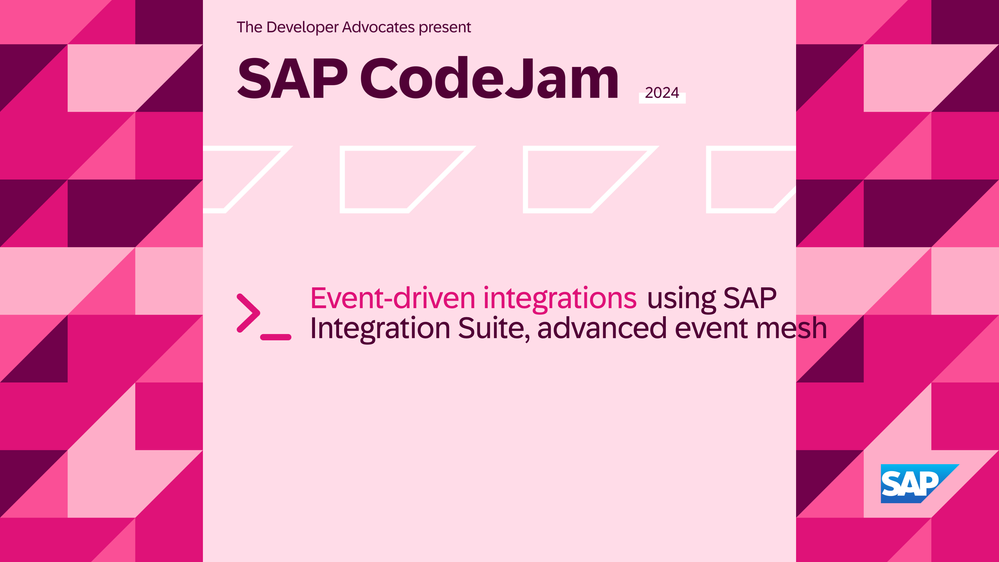

# Event-Driven Integrations with SAP Integration Suite, Advanced Event Mesh

---
## *SAP CodeJam events scheduled*

- 2024-05-06: 🇪🇸 SAP CodeJam: Event-Driven Integrations using SAP Integration Suite, advanced event mesh (Madrid, Spain) - RSVP 🗓️.

     
    <i>SAP CodeJam in Madrid</i>

---

Welcome to the Event-Driven Integrations CodeJam repository. In this SAP CodeJam, we will look at [SAP Integration Suite, Advanced Event Mesh](https://discovery-center.cloud.sap/serviceCatalog/advanced-event-mesh?service_plan=default&region=all&commercialModel=cloud) and how we can use them to enable event-driven architecture and scenarios across multiple systems and services in our landscape. By the end of the CodeJam, we will achieve a scenario like the one below in the diagram.

## Integration Scenario

Let's imagine we work for a company, ITeLO Entertainment. IteLO Entertainment is responsible for organizing the largest music festival in Europe. The company has a website through which music fans can purchase tickets. Other services rely on this data to generate a PDF ticket or send a physical ticket to the buyer. Also, there is the possibility of purchasing a VIP package which also requires a separate delivery. All performers part of the event are reflected in SAP S/4HANA as Business Partners. These performers go through a separate approval process which is managed in SAP Build Process Automation.

Currently, our applications and services expose their data via APIs. The different services use a [poll mechanism](https://www.enterpriseintegrationpatterns.com/patterns/conversation/Polling.html) to check if there is any new data (tickets/BPs) that needs to be processed. ITeLO is interested in adopting an event-driven approach to how it processes its data and is looking to adapt its application to follow a [publish-subscribe pattern](https://help.pubsub.em.services.cloud.sap/Get-Started/message-exchange-patterns.htm#Publish-). Following this pattern will enable them to easily extend and add new functionality, in the form of [new services](https://www.enterpriseintegrationpatterns.com/patterns/conversation/SubscribeNotify.html), which can fulfill new business cases in the future where the same data is required for further processing.

We are in charge of enabling the event-driven integration scenario that will allow our applications and services to create (produce) events and react (consume) to them.

## Prerequisites

The prerequisites to follow the exercises in this repository, including hardware and software, are detailed in the [prerequisites](prerequisites.md) file.

### Live system

As part of this CodeJam we will provide you access to a live SAP Integration Suite, advanced event mesh instance. Whenever you see the following emoji - 🔐 - in the exercises, it means that your instructor will provide details to access/configure a live system. 

<i>What if a live system can't be provided as part of the CodeJam or you are going through the CodeJam content on your own?</i>

 

There are two options here:
1. The participant can configure a live system that they have access to and will be able to follow the instructions in this CodeJam.

## Material organization

The material consists of a series of exercises. These exercises build on each other and should be completed in the given order. For example, we start by learning about the different types of events, proceed to interact with events and we will extend this event in the subsequent exercises.

The repository includes some [slides](slides.md), which will be used when running an SAP CodeJam event. The slides were built using [Marp](https://github.com/marp-team/marp/) and an HTML export is included [here](slides.html). You can also [preview the slides here](https://htmlpreview.github.io/?https://github.com/SAP-samples/event-driven-integrations-codejam/blob/main/slides.html).

## Exercises

During the CodeJam you will complete each exercise one at a time. At the end of each exercise, questions are included to help you think about the content just covered and are to be discussed with the entire CodeJam class, led by the instructor, when everyone has finished that exercise.

If you finish an exercise early, please resist the temptation to continue with the next one. Instead, explore what you've just done and see if you can learn more about the subject covered. That way, we all stay on track together and can benefit from some reflection via the questions (and answers).

See below for an overview of the exercises part of this CodeJam.

* Please ensure that you have completed all the [prerequisites](prerequisites.md).
* Exercises:
  * [Exercise 01 - Events in the SAP Ecosystem](./exercises/01-events-sap-ecosystem/README.md)
  * [Exercise 02 - Cloud Events](./exercises/02-cloudevents/README.md)
  * [Exercise 03 - SAP's adoption of CloudEvents](./exercises/03-cloudevents-at-sap/README.md)
  * [Exercise 04 - Event-Driven Architectures](./exercises/04-event-driven-architectures/README.md)
  * [Exercise 05 - Explore SAP Integration Suite, advanced event mesh](./exercises/05-explore-aem/README.md)
  * [Exercise 06 - Publish and subscribe to events](./exercises/06-publish-and-subscribe-events/README.md)
  * [Exercise 07 - Exchanging messages between Event Broker Services (Dynamic Message Routing)](./exercises/07-dynamic-message-routing/README.md)
  * [Exercise 08 - Create a CloudEvent programmatically (CloudEvents SDK)](./exercises/08-cloudevents-sdk/README.md)
  * [Exercise 09 - Forward messages in Queue to REST Consumer (REST Delivery Points/webhooks)](./exercises/09-rest-delivery-points/README.md)

* DRAFT Exercises:
  * Events in the SAP ecosystem
  * CloudEvents
  * SAP's adoption of CloudEvents
  * Event-Driven Architectures
  * Explore SAP Integration Suite, advanced event mesh
  * Publish and subscribe to events
  * Exchanging messages between Event Broker Services (Dynamic Message Routing)
  * REST Delivery Points (webhooks)
  * Create a CloudEvent programatically
  * Consume messages from CAP project
  * Produce messages from CAP project
  * Optional:
    * Documenting our event-driven architecure (Event Portal)
    * Connect remote broker to an Event Broker service

### Troubleshooting

While going through the exercises, you might encounter common problems not explicitly related to them. Check out the [troubleshooting.md](troubleshooting.md) page, which includes a list of these common problems and their potential solutions.

## Known Issues

None

## Feedback

If you can spare a couple of minutes at the end of the session, please help us improve for next time by giving me some feedback.

Simply use this [Give Feedback](https://github.com/SAP-samples/event-driven-integrations-codejam/issues/new?assignees=&labels=feedback&template=session-feedback-template.md&title=Feedback) link to create a special "feedback" issue, and follow the instructions there.

Gracias/Thank you/Obrigado/Merçi/Danke!

## How to obtain support
Support for the content in this repository is available during CodeJam events, for which this content has been designed.

Alternatively, if you are completing this CodeJam on your own, outside of an event, you can [create an issue](https://github.com/SAP-samples/event-driven-integrations-codejam/issues/new) in this repository if you find a bug or have questions about it.
 
For additional support, [ask a question in SAP Community](https://community.sap.com/t5/forums/postpage/board-id/application-developmentforum-board).

## Contributing
Please send a pull request if you wish to contribute code or offer fixes or improvements. Due to legal reasons, contributors will need to accept a DCO when they create the first pull request for this project. This happens in an automated fashion during the submission process. SAP uses [the standard DCO text of the Linux Foundation](https://developercertificate.org/).

## License
Copyright (c) 2024 SAP SE or an SAP affiliate company. All rights reserved. This project is licensed under the Apache Software License, version 2.0 except as noted otherwise in the [LICENSE](LICENSES/Apache-2.0.txt) file.
