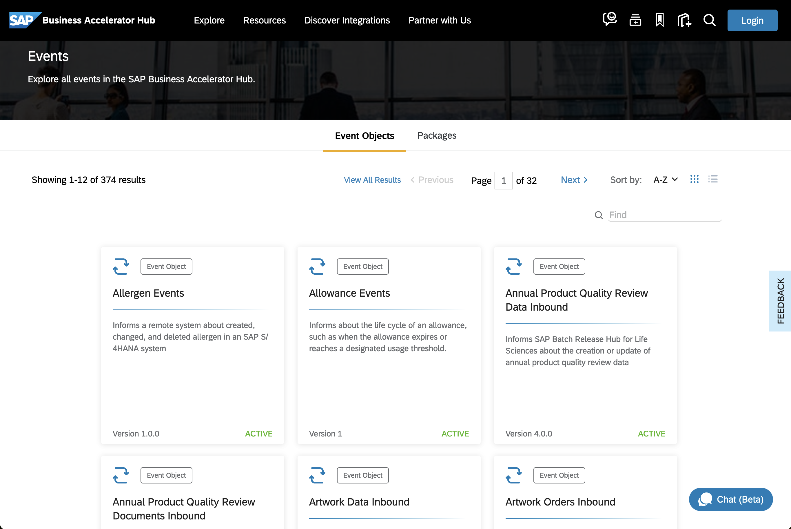

# Exercise 01 - Events in the SAP Ecosystem

Before we start exchanging events between our systems, let's get familiar with the events that SAP applications can produce. In the SAP Business Accelerator Hub, you can discover, explore, and test the different types of content available for SAP products, as well as third-party products. The content available here can be used to accelerate the development of integrations and extensions required at your company. 

At the end of this exercise, you'll have an understanding of the SAP Business Accelerator Hub, the different SAP products that can generate events and the different types of events that you will be able to find in it.

## Tour the events section in the SAP Business Accelerator Hub

Let's start by exploring the Events section part of the SAP Business Accelerator Hub.

👉 Navigate to the SAP Business Accelerator Hub ([https://hub.sap.com](https://hub.sap.com)) and select the [Events category](https://hub.sap.com/content-type/Events/events/events) to list all the events produced by different SAP applications.

<p align = "center">
    <br/>
    <i>Events category in the SAP Business Accelerator Hub</i>
</p>

This will list more than 350 events available. Let's group these events by SAP application and get familiar with the events produced by a particular SAP application.

👉 Click on the `Packages` tab, select the [SAP Marketing Cloud Business Events](https://hub.sap.com/package/SAPMarketingCloudBusinessEvents/event)

<p align = "center">
    <br/>
    <i>Navigate to SAP Marketing Cloud Business Events</i>
</p>

## Type of events

The two most common type of events that we will normally interact with are known as notification events and event-carried state transfer events. They mainly differ in the amount of information included in the payload. Let's explore this further.

### Notification events

A notification event is a message that is sent to inform that something has happened. It is a simple message that does not contain much data. For example, a notification event could be sent to inform that a new customer has been created in a system and within its payload it might just contain an id.

As an example, let's use the [`Marketing Campaign Events`](https://hub.sap.com/event/CE_MARKETINGCAMPAIGNEVENTS/resource) available from SAP Marketing Cloud in the SAP Business Accelerator Hub. We can see that there is an operation available - `ce/sap/s4/beh/marketingcampaign/v1/MarketingCampaign/Completed/v1`, and within it, we can find the headers and payload of the event. This event is an example of a notification event:

```json
{
  "type": "sap.s4.beh.marketingcampaign.v1.MarketingCampaign.Completed.v1",
  "source": "",
  "datacontenttype": "application/json",
  "specversion": "1.0",
  "subject": "string",
  "id": "QgEK7wzuHtqdhJwqCS+VOA==",
  "time": "2018-04-05T17:31:00Z",
    "data": {
        "CampaignUUID": "265239ce-e1b5-46a9-8c6d-dc68a238fd18"
    }
}
```

> In the [Explore the Business Partner events available in SAP S/4HANA Cloud](#explore-the-business-partner-events-available-in-sap-s4hana-cloud) section below, we share an example of another notification event, this time from the Business Partner object produced by an SAP S/4HANA Cloud system.

### Event-Carried State Transfer (ECTS) events

An event-carried state transfer event is also a message that is sent to inform that something has happened but different to the notification event, it includes the data that has changed. For example, an ECTS event could be sent to inform that a new customer has been created in a system and include the data of the new customer.

As an example, let's get familiar with the [`SAP Digital Vehicle Hub Business Events`](https://hub.sap.com/event/SAPDigitalVehicleHubBusinessEvents_SAPDigitalVehicleHubBusinessEvents/resource) available from SAP Digital Vehicle Hub in the SAP Business Accelerator Hub. We can see that there is an operation available - Vehicle Created (`/sap.dmo.dvh.Vehicle.Created.v1`), and within it, we can find an example payload of the event. You can see that it contains lots of information, e.g. Vehicle information, Business partners info, storage location, model specification, vehicle specification, tire information, etc. The [full sample](assets/vehicle-created-sample.json) can be found in the assets folder. This event is an example of an ECTS event:

```json
{
    "specversion": "1.0",
    "type": "sap.dmo.dvh.Vehicle.Created.v1",
    "source": "/eu10/sap.dmo.dvh",
    "subject": "808E6E30B65149978A443429B29FB300",
    "id": "a823e884-5edc-4194-a81a-f3a3632417ee",
    "time": "2018-04-08 08:31:00",
    "datacontenttype": "application/json",
    "sappassport": "string",
    "data": {
        "vehicle": {
            "vehicleIdentifyingElements": {
                "id": "808E6E30B65149978A443429B29FB300",
                "externalID": "vehicle-008",
                "vin": "1234567898888888"
            },
            "additionalBusinessPartner": [
                {
                    "id": "string",
                    "role": "string"
                }
            ],
            "description": [
                {
                    "short": "string",
                    "long": "string",
                    "language": "string"
                }
            ],
            "vehicleImageURL": "string",
            "sourceSystemID": "string",
            "buildDate": "string",
            "plannedIndicator": true,
            "batchNumber": "string",
            "businessTypeCode": "string",
            "availabilityCode": "string",
            "plantID": "string",
            "plantName": "string",
            "storageLocationID": "string",
            "storageLocationDescription": "string",
            "modelSpecification": {
                "modelExternalID": "string",
                "modelName": "string",
                "manufacturerName": "string"
            },
            "vehicleSpecification": {
                "interiorColor": "string",
                "exteriorColor": "string",
                "upholstery": "Leather",
                "upholsteryColor": "string",
                "wheelType": "Alloy",
            ...
}
```

## Explore the Business Partner events available in SAP S/4HANA Cloud 

As part of this CodeJam, we will interact with the Business Partner data from an SAP S/4HANA Cloud system. The Business Partner events

👉 Now that you are familiar with how to get around the SAP Business Accelerator Hub, search for the [Business Partner events](https://api.sap.com/products/SAPS4HANACloud/apis/all) available for SAP S/4HANA Cloud Public Edition, check out the different operations and get acquainted with the payload for the Business Partner changed event - [https://hub.sap.com/event/CE_BUSINESSPARTNEREVENTS/resource](https://hub.sap.com/event/CE_BUSINESSPARTNEREVENTS/resource).

```json
{
    "type": "sap.s4.beh.businesspartner.v1.BusinessPartner.Changed.v1",
    "specversion": "1.0",
    "source": "/default/sap.s4.beh/244572008",
    "id": "194780e0-b5db-1ede-b58a-4550178dff9e",
    "time": "2024-02-26T02:53:06Z",
    "datacontenttype": "application/json",
    "data": {
        "BusinessPartner": "1000667"
    }
}
```

🧭 Take some time to explore what's documented on the [Business Partner events - Overview page](https://hub.sap.com/event/CE_BUSINESSPARTNEREVENTS/overview). You will be able to find lots of valuable information here, e.g. [event reference](https://hub.sap.com/event/CE_BUSINESSPARTNEREVENTS/resource), event specifications (in JSON and YAML format), and a link to the [documentation](https://help.sap.com/docs/SAP_S4HANA_CLOUD/3c916ef10fc240c9afc594b346ffaf77/a75345282ddd4054a1e5ce7687e4b088.html?locale=en-US&state=PRODUCTION&version=2402.500).

Now, you might have noticed that the event samples shared in this exercise are in JSON format and follow a specific format. They all contain a similar structure, some header information (metadata) describing the message, e.g. `id`, `type`, `specversion`, `source`, `type`, `datacontenttype` and a `data` node, which includes the actual payload. This is because SAP has adopted the CloudEvents specification as the common format for its systems/applications to publish events. In the next exercise, we will explore the CloudEvents format, which is a specification for commonly describing event data.

## Summary

Now that you are familiar with some of the events available in the SAP Business Accelerator Hub, we are ready to start exploring the format used to describe the events. Enter CloudEvents.

## Further Study

* Explore the events in the SAP Business Accelerator Hub - [link](https://hub.sap.com/content-type/Events/events/events)
* CloudEvents at SAP - [link](https://community.sap.com/t5/application-development-blog-posts/cloudevents-at-sap/ba-p/13620137)

---

If you finish earlier than your fellow participants, you might like to ponder these questions. There isn't always a single correct answer and there are no prizes - they're just to give you something else to think about.

1. Can you think of reasons why would you prefer publishing notification events instead of data events?
2. Which format is used to document the Business Partner event specification?
   <details>
    <summary>⇟ Hint 🔦</summary>
    <i>Go to the Business Accelerator Hub and open the Business Partner event specification, in JSON or YAML format.</i>
    </details>
3. The Business Partner event above, will it be considered an ECTS event or a notification event?

## Next

Continue to 👉 [Exercise 02 - Cloud Events](../02-cloudevents/README.md)
