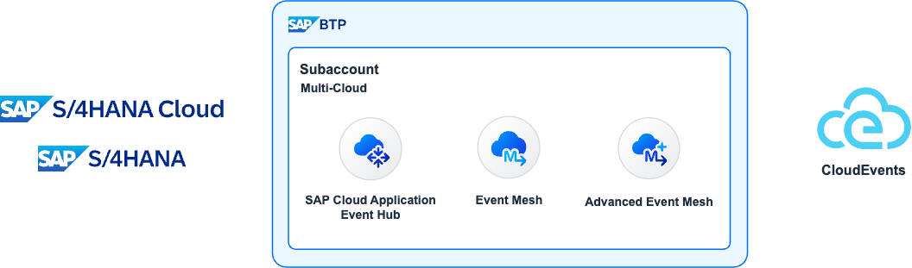
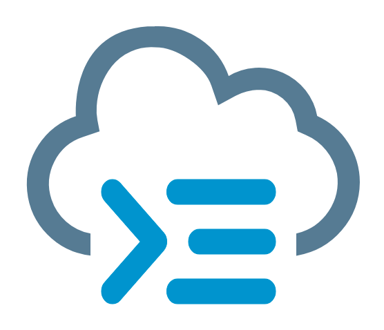
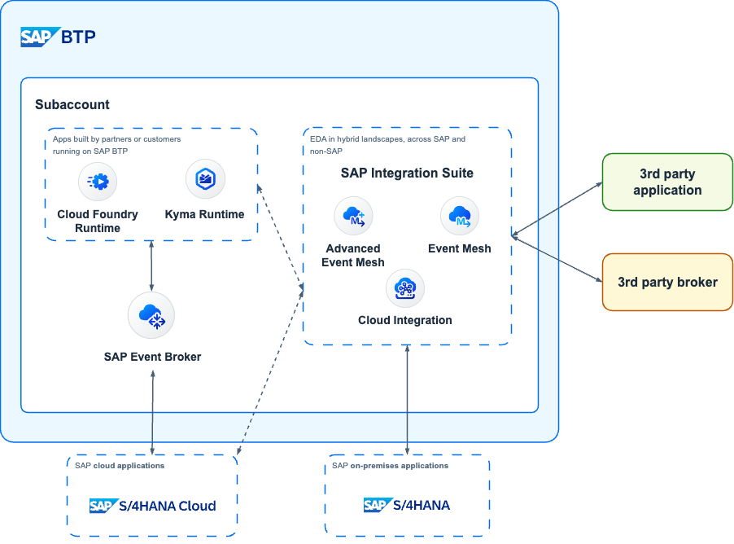
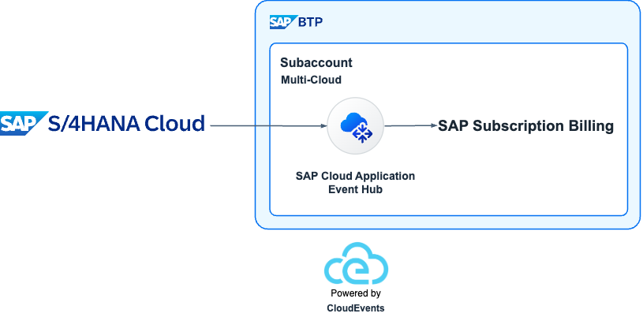
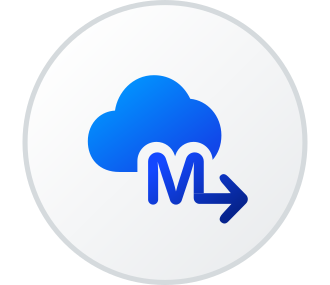
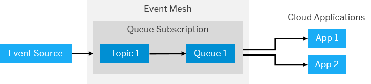
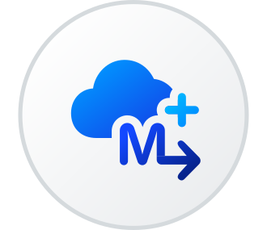

# Exercise 03 - SAP's adoption of CloudEvents

In the previous exercise, we got familiar with the CloudEvents specification. Now we will have a look on why being familiar with the CloudEvents specification is important in the SAP world.



## CloudEvents at SAP

SAP is an [active contributor](https://github.com/cloudevents/spec/blob/main/docs/contributors.md "https://github.com/cloudevents/spec/blob/main/docs/contributors.md") to the CloudEvents specification and one of its many [adopters](https://cloudevents.io/ "https://cloudevents.io/"). Evidence of that is the different products ([event packages](https://hub.sap.com/content-type/Events/events/packages "https://hub.sap.com/content-type/Events/events/packages")) that we can find documented in the [SAP Business Accelerator Hub > Events category](https://hub.sap.com/content-type/Events/events/events "https://hub.sap.com/content-type/Events/events/events").

The products listed below document their events in the form of event packages in the [SAP Business Accelerator Hub](https://hub.sap.com/ "https://hub.sap.com/"). All their events follow the CloudEvents specification:

* SAP Agricultural Origination Portal
* SAP Batch Release Hub for Life Sciences
* SAP Cell and Gene Therapy Orchestration
* SAP Cloud for Utilities Foundation
* SAP Digital Vehicle Hub
* SAP GRC Cloud - Issue Management and Remediation Service
* SAP Industry Process Framework
* SAP Intelligent Clinical Supply Management for Operations
* SAP Intelligent Clinical Supply Management for Planning
* SAP Landscape Management Cloud
* SAP Marketing Cloud
* SAP Order Management Foundation
* SAP S/4HANA
* SAP S/4HANA Cloud Public Edition
* SAP S/4HANA Utilities for Customer Engagement
* SAP S/4HANA for Procurement Planning Cloud
* SAP Subscription Billing

SAP's flagship ERP products, SAP S/4HANA Cloud Public edition and SAP S/4HANA, expose more than 600+ events combined. As you might have noticed from the events that we use as examples above, these events follow the CloudEvents specification. Below we can see the BusinessPartner Created event generated by an SAP S/4HANA Cloud Public Edition and we can see how it follows the CloudEvents specification.

```json
{
    "type": "sap.s4.beh.businesspartner.v1.BusinessPartner.Created.v1",
    "specversion": "1.0",
    "source": "/default/sap.s4.beh/244572008",
    "id": "194780e0-b5db-1ede-b58a-4550178dff9e",
    "time": "2024-02-26T09:50:00Z",
    "datacontenttype": "application/json",
    "data": {
        "BusinessPartner": "1000667"
    }
}
```

### Cloud Application Programming model

<p align = "center">
  <br/>
  <!-- <i>SAP Event Broker for SAP cloud applications</i> -->
</p>

CAP messaging has built-in support for formatting event data compliant with the CloudEvents standard. This can be enabled by using the format config option within messaging:

```json
"cds": {
  "requires": {
    "messaging": {
      "format": "cloudevents"
    }
  }
}
```

With this setting, all mandatory and some more basic header fields, like `type`, `source`, `id`, `datacontenttype`, `specversion`, `time` are filled in automatically. The event name is used as `type`. The message payload is in the `data` property.

> Although we will be using CAP in this CodeJam, we will not be able to leverage this built-in support as we will be using the SAP Integration Suite, advanced event mesh to publish and consume events. Also, we will be using the CloudEvents SDK to create CloudEvents programmatically.

### Kyma

<p align = "center">
  <br/>
  <!-- <i>SAP Event Broker for SAP cloud applications</i> -->
</p>


Kyma contains an [Eventing module](https://kyma-project.io/#/06-modules/README "https://kyma-project.io/#/06-modules/README"), which provides functionality to publish and subscribe to CloudEvents. It follows the PubSub messaging pattern and all events in Kyma conform to the CloudEvents specification\[5\]. At the moment, NATS (provided by the NATS module) and SAP Event Mesh are [supported as backends](https://help.sap.com/docs/btp/sap-business-technology-platform/choose-backend-for-kyma-eventing "https://help.sap.com/docs/btp/sap-business-technology-platform/choose-backend-for-kyma-eventing") for eventing and it is recommended to use the CloudEvents specification for sending and receiving events. Even the legacy events are automatically converted to CloudEvents.

## SAP's event-driven portfolio

)

 SAP offers various services that can help customers embrace event-driven architectures. The different offerings can meet customers where they are in their EDA adoption/implementation journey. These are:

* SAP Event Broker for SAP cloud applications
* SAP Event Mesh
* SAP Integration Suite, advanced event mesh

### [SAP Event Broker for SAP cloud applications](https://discovery-center.cloud.sap/serviceCatalog/sap-event-broker?region=all&service_plan=standard&commercialModel=cpea "https://discovery-center.cloud.sap/serviceCatalog/sap-event-broker?region=all&service_plan=standard&commercialModel=cpea")

<p align = "center">
  <br/>
  <!-- <i>SAP Event Broker for SAP cloud applications</i> -->
</p>

SAP Event Broker is the latest service released by SAP that focuses on event-driven architecture and it supports event-based integration between SAP cloud and BTP-based applications. It is a fully managed cloud service that allows SAP cloud applications to communicate asynchronously through events. Meaning it can be used to distribute events between SAP cloud applications. For example, this service can be leveraged to enable seamless integration between [SAP S/4HANA Cloud public edition and SAP Subscription Billing](https://help.sap.com/docs/CLOUD_TO_CASH_OD/559eeb1cc256428c9bb3b9cf9f3480ba/6407b895ff9f4be6a4d417db2226eae4.html?locale=en-US "https://help.sap.com/docs/CLOUD_TO_CASH_OD/559eeb1cc256428c9bb3b9cf9f3480ba/6407b895ff9f4be6a4d417db2226eae4.html?locale=en-US"). When an integration scenario leverages SAP Event Broker, it eliminates having to configure an event storage or infrastructure such as customer-defined topics or queues to enable the event-based integration between systems.



CloudEvents are first-class citizens in SAP Event Broker, as events that are distributed between SAP cloud applications using SAP Event Broker all conform to the [CloudEvent Specification](https://github.com/cloudevents/spec/blob/v1.0.2/cloudevents/spec.md "https://github.com/cloudevents/spec/blob/v1.0.2/cloudevents/spec.md")\[6\]. Evidence of this is how we can [filter SAP event subscriptions](https://help.sap.com/docs/event-broker/event-broker-service-guide/filtering-sap-event-subscriptions?locale=en-US "https://help.sap.com/docs/event-broker/event-broker-service-guide/filtering-sap-event-subscriptions?locale=en-US") by defining filters based on the CloudEvent context attributes, e.g. by filter by [type, subject, or extension context attribute](https://help.sap.com/docs/event-broker/event-broker-service-guide/event-filter-examples?locale=en-US "https://help.sap.com/docs/event-broker/event-broker-service-guide/event-filter-examples?locale=en-US"). _Note: This is an example of content-based filtering taking place in the message-oriented middleware._

If all your event needs are within the SAP cloud world, e.g. exchange events between SAP cloud applications and SAP BTP, this service can fulfill your needs.

### [SAP Event Mesh](https://discovery-center.cloud.sap/serviceCatalog/event-mesh?region=all "https://discovery-center.cloud.sap/serviceCatalog/event-mesh?region=all") 

<p align = "center">
  <br/>
  <!-- <i>SAP Event Broker for SAP cloud applications</i> -->
</p>

SAP Event Mesh allows applications to communicate through asynchronous events. It can be used to publish and consume business events from SAP and non-SAP sources across hybrid landscapes from the digital core (ERP products, e.g. SAP S/4HANA Cloud public edition and SAP S/4HANA) to extension applications through event-driven architecture. It is a fully managed [centralised event-oriented](https://help.sap.com/docs/event-mesh/event-mesh/event-mesh-default-plan-concepts?locale=en-US "https://help.sap.com/docs/event-mesh/event-mesh/event-mesh-default-plan-concepts?locale=en-US") service part of SAP BTP.

> SAP Event Mesh is intended to move into SAP Integration Suite, as a new capability, in Q2 2024. You can find more details in [https://roadmaps.sap.com](https://roadmaps.sap.com/board?PRODUCT=000D3A47875C1EDB98A8A910864AC24B&range=FIRST-LAST#;INNO=C1FBB5A935A51EDDA5E7942074F76CBC).



The [service supports the use of REST APIs for Events](https://help.sap.com/docs/event-mesh/event-mesh/rest-apis-for-events?locale=en-US "https://help.sap.com/docs/event-mesh/event-mesh/rest-apis-for-events?locale=en-US"), for publishing and consuming events that are compliant with the CloudEvents specification. Related to event-based integrations, events that flow through SAP Event Mesh between SAP applications must all conform to the CloudEvents specification.

> You can check out how to enable the consumption of SAP S/4HANA Cloud public edition events in your SAP BTP account - [https://youtu.be/4LspIL3NxqQ](https://youtu.be/4LspIL3NxqQ "https://youtu.be/4LspIL3NxqQ")

### [SAP Integration Suite, advanced event mesh](https://discovery-center.cloud.sap/serviceCatalog/advanced-event-mesh?region=all "https://discovery-center.cloud.sap/serviceCatalog/advanced-event-mesh?region=all") (AEM)

<p align = "center">
  <br/>
  <!-- <i>SAP Event Broker for SAP cloud applications</i> -->
</p>

SAP Integration Suite, advanced event mesh (AEM) is a complete event streaming, event management, and monitoring platform that incorporates best practices, expertise, and technology for event-driven architecture (EDA) on a single platform. With AEM you can deploy event broker services, create event meshes, and optimise and monitor your event-driven system.

AEM offers these categories of services:

*   **Event Streaming**: It provides event streaming services and gives you access to event broker services that provide advanced features like the publish-subscribe messaging pattern, queuing, streaming, replay, and request-reply, while doing all the heavy lifting to dynamically deploy, upgrade, patch, and operate the service. It extends beyond the cloud and supports infrastructure and EDAs across hybrid cloud solutions and your on-premises deployments.
    
    > Event brokers can be deployed to: public clouds administered by SAP (Public Regions or Dedicated Regions) and customer's own regions in the cloud or on-premises (Customer-Controlled Regions)
    
*   **Event Management**: It provides event management services. The Event Portal provides powerful tools to create, design, share, and manage various aspects of your EDA based on event brokers or other streaming technologies. It fully supports the AsyncAPI 2.0.0 specification so that you can generate code, documentation, validate events, and apply API management policies for applications in your EDA.
    
    > You might have noticed that some event specification in the SAP Business Accelerator Hub are documented using the AsyncAPI specification, e.g. [Marketing Campaign Events](https://hub.sap.com/event/CE_MARKETINGCAMPAIGNEVENTS/overview "https://hub.sap.com/event/CE_MARKETINGCAMPAIGNEVENTS/overview") part of SAP Marketing Cloud.
    
*   **Event Monitoring and Insights**: Availability out-of-the-box of dashboards and easy-to-understand visualizations based on historical and real-time metrics, and timely notifications about the event broker services deployed.
    

Similar to SAP Event Mesh, it can be used to publish and consume business events from SAP and non-SAP sources across hybrid landscapes. Meaning, if your event data needs to exit the SAP cloud world, you can use any of these two services.

## Summary

Now that we are familiar with CloudEvents and how the specification has been adopted by SAP, let's focus on one of the products available as part of the SAP event-driven portfolio, SAP Integration Suite, advanced event mesh.

## Further Study
    
- Eventing module in Kyma: [link](https://kyma-project.io/#/eventing-manager/user/README "https://kyma-project.io/#/eventing-manager/user/README")
- CAP events & messaging - CloudEvents standard: [link](https://cap.cloud.sap/docs/guides/messaging/#cloudevents)
- SAP Event-Driven integrations: [link](https://help.sap.com/docs/event-broker/event-broker-service-guide/event-driven-integrations?locale=en-US%3Fversion%3DCloud "https://help.sap.com/docs/event-broker/event-broker-service-guide/event-driven-integrations?locale=en-US%3Fversion%3DCloud")

---

If you finish earlier than your fellow participants, you might like to ponder these questions. There isn't always a single correct answer and there are no prizes - they're just to give you something else to think about.

1. Which of the SAP event-driven services would you use if you wanted to enable seamless integration between SAP S/4HANA Cloud public edition and SAP Subscription Billing?
2. What are the benefits of adopting the CloudEvents specification when an event can be anything when using services like SAP Event Mesh and SAP Integration Suite, advanced event mesh?
3. Which service can I use, [for free*](https://discovery-center.cloud.sap/serviceCatalog/sap-event-broker?service_plan=standard&region=all&commercialModel=btpea&tab=service_plan), if all my event needs are within the SAP cloud world?

## Next

Continue to 👉 [Exercise 04 - Event-Driven Architectures](../04-event-driven-architectures/README.md)
