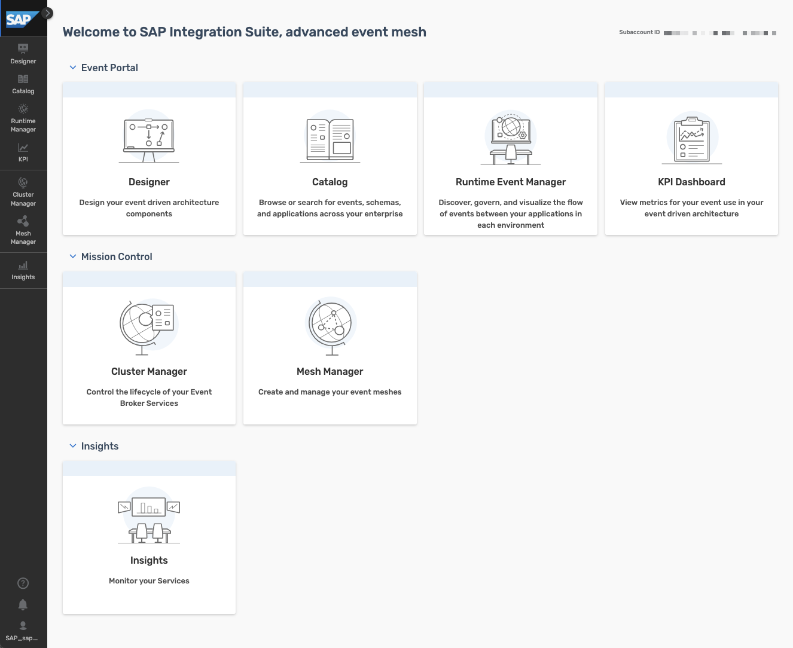
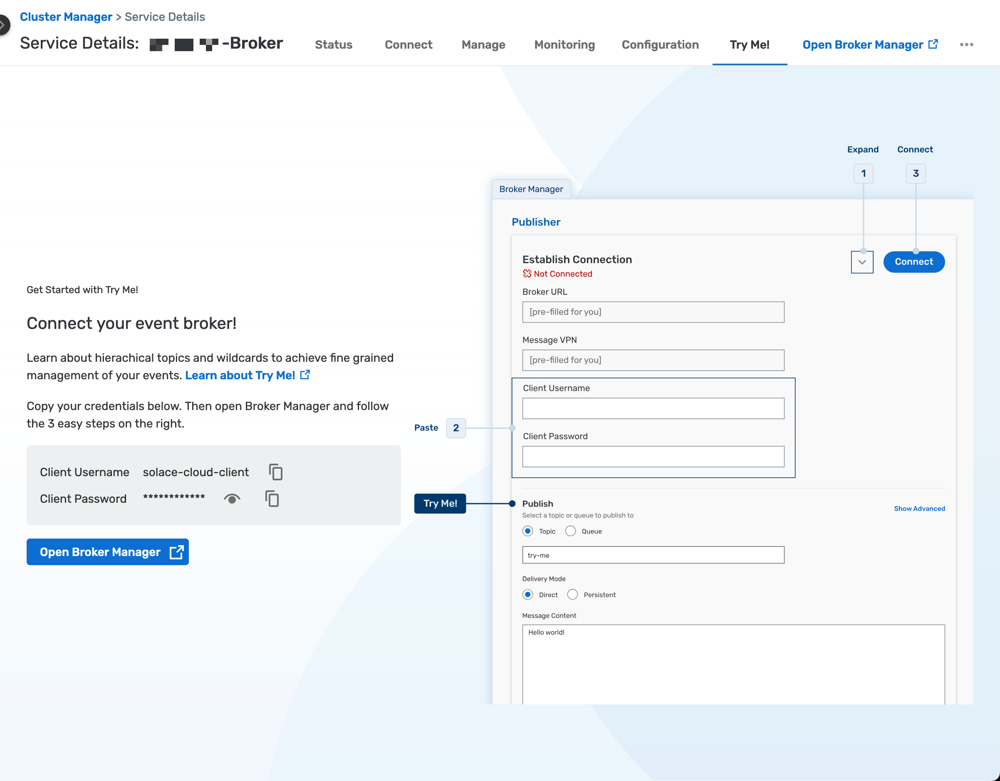

# Exercise 05 - Explore SAP Integration Suite, advanced event mesh

So far, we've learned about events in the SAP ecosystem, CloudEvents and the different products that are part of SAP's event-driven portfolio. In this exercise, we will start interacting with SAP Integration Suite, advanced event mesh and we will get familiar with some key parts of the product.

## Access the SAP Integration Suite, advanced event mesh instance

Let's log in to the SAP Integration Suite, advanced event mesh instance that we've made available for the event.
> 🔐 Your instructor will provide you with the details to access the SAP Integration Suite, advanced event mesh instance.

👉 Navigate to the instance URL provided, e.g. `https://[region].console.pubsub.em.services.cloud.sap/login?tenant-id=[our-tenant-id]`, and enter the user credentials provided to you, e.g. `EDI-[country]-[your-sap-community-username]@sap.com`.

     
    <i>AEM start page</i>

The start page is divided into three sections:

- Event Streaming: Here we can access the cluster and mesh managers, through which we can manage the event brokers and event meshes in our instance.
- Event Management: The different event management services are available here. For example, the Event Portal, through which we can create, design, share, and manage various aspects of your EDA based on event brokers or other streaming technologies.
- Event Insights: SAP Integration Suite, advanced event mesh has dashboards and visualizations available out of the out-of-the-box. Through here we are able to monitor the event brokers deployed.

## Mission Control

Mission Control, is where we manage the event brokers, event meshes and monitor the health of our SAP Integration Suite, advanced event mesh instance.

Mission control is divided into two sections:

- Cluster Manager: Here we can find the event broker services available in our instance. Through here we can also create, configure and delete event brokers.

    👉 Navigate to Mission Control > Cluster Manager and view the event broker services available

    

         
        <i>Cluster Manager - Show all services</i>
    

- Mesh Manager: In Mesh Manager, we can create and manage our event meshes. An event mesh is composed of multiple event brokers that can span different data centers. Note: An event broker can only belong to a single mesh.

    👉 Navigate to Mission Control > Mesh Manager and view the event mesh available

    

         
        <i>Mesh Manager</i>
    

### Event Broker services

The event broker service is the main object that we interact with in AEM. It is the service that provides the messaging capabilities to our client applications. An event broker service can be created in different cloud providers, be deployed to different regions, be part of a cluster and also be part of a mesh.

In our case, we have four event brokers:

- AMER-USEast-Broker
- APJ-IN-Broker
- EU-North-Broker
- EU-FR-DevBroker

We will not be creating an event broker service in this exercise, but we will be interacting with the existing ones. Creating an event broker service is quite simple, you just need to provide a name, a region and the service type (service class). To select the right service class, you need to know and understand the requirements of your client applications, e.g. number of client applications connecting simultaneously, maximum throughput, number of queues required, and type of traffic exchanged between client applications.

> To learn more about how to choose the right service class, visit the [documentation](https://help.pubsub.em.services.cloud.sap/Cloud/ght_pick_service_type.htm).

The animation below shows how to create an event broker service.

     
    <i>Create Event Broker service</i>

Now, let's explore an event broker service available in our instance.

👉 Navigate to Mission Control > Cluster Manager, and go to the `EU-North-Broker` event broker service. You will land in the Status tab of the service. Get familiar with the information available.

     
    <i>Event broker information</i>

In the ***Status*** tab, we will be able to get an overall status of the event broker service, know the number of active connections, the number of queues used, the state of the service, its version, when was it created, who created it, if it is part of a high availability group. Also, if this event broker service is part of a mesh. See screenshot above

👉 In the `EU-North-Broker` event broker service, go to the ***Connect*** tab of the event broker service. In the dropdown on the right hand side, select to **View by: Protocol**.  Now, expand the `REST` section part of the accordion and select the `Solace REST Messaging API` element. The connection details will be displayed on the right hand side of the screen.

In the ***Connect*** tab, we can see the connection details available for the event broker service depending on the protocol we want to use, e.g. the host, the port, the username and the password to connect to the event broker service. Depending on the protocol we use to connect, sometimes we might also need to provide Message VPN details, this is also included here.

     
    <i>Event Broker - Connect</i>

> 🚨 The connection details (username and password) available in the ***Connect*** tab are the ones set by default when creating an event broker service. That doesn't mean that they will actually work, e.g. you can update the password for the `solace-cloud-client` created with the event broker service. This is the case of the `solace-cloud-client` user in the `APJ-IN-Broker`.

👉 In the `EU-North-Broker` event broker service, go to the ***Manage*** tab of the event broker service.

In the ***Manage*** tab, we can access the event broker service manager. From here we can quickly access the clients, queues, access control and bridge of our event broker and also see the different management tools available.

     
    <i>Event Broker - Manage</i>

> 💡 An idea.... once we start connecting to an event broker, remember to visit the Clients section of an event broker to see the clients connected and its details, e.g. the username and protocol they are using to connect. 

👉 In the `EU-North-Broker` event broker service, go to the ***Monitoring*** tab of the event broker service.

In the ***Monitoring*** tab, we will be able to get a summary of the messages exchanged via our event broker. 

     
    <i>Event Broker - Monitoring</i>

👉 In the `EU-North-Broker` event broker service, go to the ***Configuration*** tab of the event broker service.

In the ***Configuration*** tab, we can see the service type (service class), the cloud provider and region where it is deployed, the upper limits of the event broker service, e.g. the maximum number of client connections, the maximum number of queues possible, the messaging storage and the maximum number of queue messages.

     
    <i>Event Broker - Configuration</i>

👉 In the `EU-North-Broker` event broker service, go to the ***Try Me!*** tab of the event broker service.

And last but certainly not least.... the ***Try Me*** tab. From here, we will be able to access the Try Me! functionality that's available from within the event broker service. Through it, we can connect to the event broker, publish messages to it and also consume messages sent to topics. This is a great way to quickly test the event broker service and exchange simple messages.

     
    <i>Event Broker - Try Me!</i>

Just as a quick test, let's use the Try Me! functionality to quickly establish a connection and exchange a message. We will achieve the communication scenario below.

     
    <i>Publish/subscribe to the try-me topic</i>

👉 In the ***Try Me!*** tab, follow the instructions below:

- Copy the credentials (`Client Username` and `Client Password`) available in the UI. These are the ones available in the ***Connect*** tab.
- Click on the `Open Broker Manager` button that's within the `Try Me!` tab.
- On the `Publisher` side, connect to the event broker service by clicking the `Connect` button.
- On the `Subscriber` side, connect to the event broker service by clicking the `Connect` button.
  - After establishing the connection, subscribe to the topic `try-me` by clicking the `Subscribe` button.
- Back on the `Publisher` side, publish a message to the topic `try-me` by clicking the `Publish` button.
- Check the message being consumed on the `Subscriber` side.

     
    <i>Try Me! - Message exchange</i>

> [!NOTE]
> We will dive deeper into the message exchange in the next exercise.

#### Event broker service as part of Cluster

When creating an event broker service we can specify a Dynamic Messaging Routing (DMR) cluster name (this is an advanced option). If we don't set it it will create a new DMR cluster name for us. By setting a DMR cluster name we tell our new event broker to be aware of other event brokers part of the same cluster and set up DMR internal links between them. DMR is the technology that allows seamless exchange of messages between connected event brokers. We will dive deeper into what DMR is in a later exercise.

In essence, every event broker service is part of a cluster, even if the cluster only has one event broker service. Communication between event broker services in the same cluster is done through DMR and if we need to exchange messages between event broker services in different clusters, we need to set up an event mesh or we can set up a Message VPN bridge. We will explore this further in the next exercises.

### Event Meshes

As we learned in the previous section, an event mesh is composed of multiple event brokers that can span different regions and data centers. An event broker can only belong to a single mesh and the communication between event broker services in a mesh is powered by DMR.

In our case, we have one mesh (`EDI CodeJam`) composed of three event broker services. Note that not all event broker services need to be part of a mesh, e.g. EU-FR-DevBroker doesn't belong to a mesh, it is a "standalone" broker.

We will not be creating an event mesh in this exercise, but we will be interacting with the existing `EDI CodeJam` mesh. Creating an event mesh is quite simple, you just need to provide a name, select the event broker services that will be part of the mesh and specify the links between the event broker services.

The animation below shows how to create an event mesh.

     
    <i>Create event mesh</i>

👉 Navigate to the Mesh Manager, go to the EDI CodeJam event mesh and **VIEW** the information available.

You will see the event broker services that are part of the mesh, the last time that there was a sync and the status of all the links. From here you will also be able to run a mesh health check.

## Insights

Insights provide us with a centralised place where we can monitor various aspects of the AEM instance:

- Resource usage
- Event mesh health
- Message flow
- High-Availability (HA) status
- Queue, topic endpoint, RDP, and bridge health
- Message spool utilization
- Capacity utilization

👉 Navigate to `Event Insights` > `Insights` and view the insights of our AEM instance.

     
    <i>Event Insights screen</i>

From here, you will also be able to access dashboards available in Datadog if [Insights advanced monitoring has been enabled](https://help.pubsub.em.services.cloud.sap/Cloud/Insights/Advanced-Monitoring/access-datadog.htm). We will not cover it in this CodeJam but you can learn more about it in the [documentation](https://help.pubsub.em.services.cloud.sap/Cloud/Insights/Advanced-Monitoring/using-dashboards.htm). One thing to highlight here is that if you already use Datadog, it will be possible to [forward the Insights data](https://help.pubsub.em.services.cloud.sap/Cloud/Insights/insights_data_forwarding.htm) to your own Datadog account.

> [!TIP]
> 💡 An idea.... once we start exchanging messages in SAP Integration Suite, advanced event mesh, remember to visit the Insights section so that you can see how the number of messages

## Summary

In this exercise, we explored the SAP Integration Suite, advanced event mesh instance that we have available for the event. We navigated through the different sections of the start page, the Cluster Manager, the Event Broker services, the Mesh Manager and the Insights section. We also exchanged our first messages through the `Try Me!` functionality available in our event broker service.

## Further Study

- Create Event Broker services - [link](https://help.pubsub.em.services.cloud.sap/Cloud/create-service.htm)
- Choosing the Right Service Class for Your Event Broker Service - [link](https://help.pubsub.em.services.cloud.sap/Cloud/ght_pick_service_type.htm)
- Creating an Event Mesh - [link](https://help.pubsub.em.services.cloud.sap/Cloud/Event-Mesh/ght_event_mesh.htm)
- DMR or a Message VPN Bridge? - [link](https://help.pubsub.em.services.cloud.sap/Features/DMR/DMR-Overview.htm#dmr-or-vpn-bridge) 
- Insights Advanced Monitoring - [link](https://help.pubsub.em.services.cloud.sap/Cloud/Insights/Advanced-Monitoring/using-dashboards.htm)

---

If you finish earlier than your fellow participants, you might like to ponder these questions. There isn't always a single correct answer and there are no prizes - they're just to give you something else to think about.

1. Which protocols can we use to connect to an event broker service in SAP Integration Suite, advanced event mesh?
2. Can you list some of the programming languages that there are SDKs available for, which can be used for Solace Messaging?

## Next

Continue to 👉 [Exercise 06 - Publish and subscribe to events](../06-publish-and-subscribe-events/README.md)
