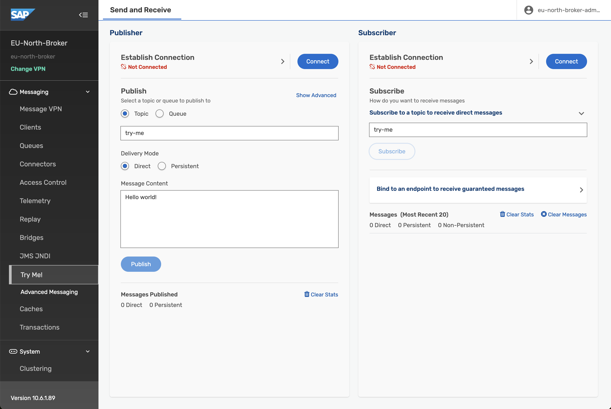
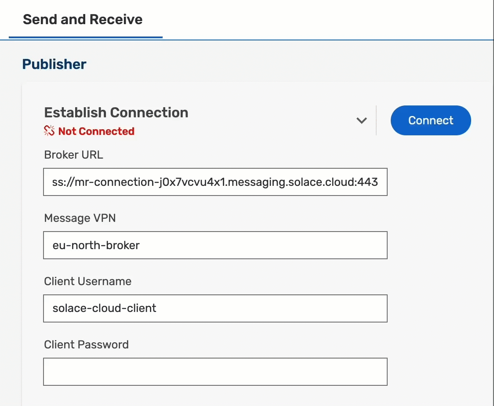
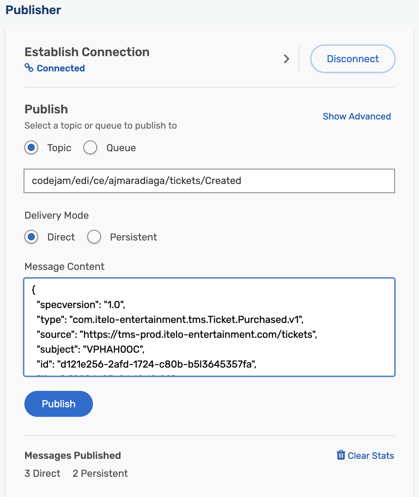
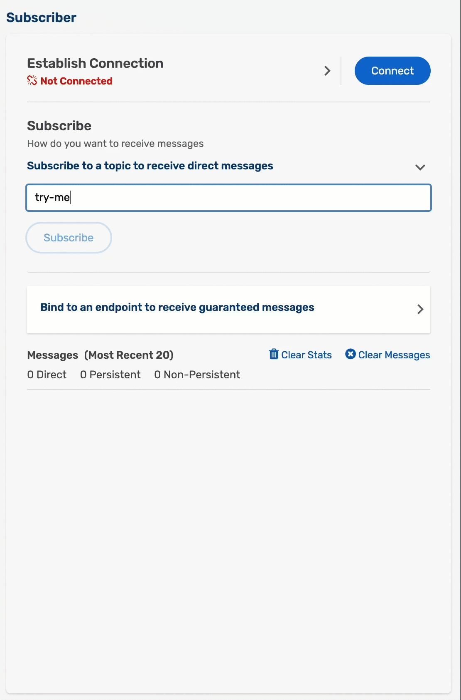

# Exercise 06 - Publish and subscribe to events

In a previous exercise, we learned more about Event-Driven Architecture and we are now familiar with the basic UI elements in SAP Integration Suite, advanced event mesh (AEM). In this exercise, we will dive deeper into the message exchange, still by using the UI in AEM and we will also explore a different section through which you can exchange messages. Before we get to the exercise, we might need to expand a bit on some concepts. Let's get started.

<p align = "center">
  <br/>
  <i>Try Me! with Queue functionality</i>
</p>

> You might have noticed that the `Try Me!` page in the screenshot above has more functionality than the one we used in the previous exercise. To differentiate between both of them I will refer to the one in the screenshot as `Advanced Try Me!` and to the one used in the previous exercise as `CodePen Try Me!`.

## Topics

In a previous exercise, we mentioned that a topic is a means by which a publisher classifies a message. The topic tells us what type of message we will receive if we subscribe to a specific topic. In essence, it is a string that is composed of one or more levels. Each level is separated by a forward slash (/) and the levels can be anything. This is commonly known as topic-level granularity. The granularity allows for more targeted and efficient information exchange. Instead of having a single topic for all updates on a business object in a complex system (/BusinessPartner), the system can have distinct topics for different types of updates on a business object (/BusinessPartner/Created, /BusinessPartner/Updated, /BusinessPartner/Deleted). There is no specific schema/specification on how you need to structure your topic string but you do find that patterns are established within a system. Let's get familiar with the structure of a topic by "dissecting" a real-world topic. Below we can see a topic on which an SAP S/4HANA Cloud system will publish a Business Partner message.

Example: `sap/S4HANAOD/E4L/ce/sap/s4/beh/businesspartner/v1/BusinessPartner/Created/v1`:
-  *sap/S4HANAOD/E4L*: System information.
-  */ce*: CloudEvent. We know that all events published by an SAP S/4HANA Cloud system follow the CloudEvent specification
-  */sap/s4*: This is coming from an SAP S/4HANA system.
-  */beh/businesspartner/v1/BusinessPartner*: Information of the Business object that we will be receiving.
-  */Created*: This is the action that took place in the source system. In this case, it is notifying us that a BusinessPartner was created. Many actions can take place in a system, e.g. this could be `/Updated`, `/Deleted`. In other case if we were dealing with a business object like a PurchaseOrder, there could be an event raised when it is `/Cancelled` or `/Rejected`.
-  */v1*: Version of the message. If a new version of the message is made available, e.g. adding new fields to the payload, then this will change.

> In our case, we've defined levels on our topic string based on the week, SAP Community username and action, e.g. `codejam/edi/ce/ajmaradiaga/notification`.

Now, by knowing the topic on which a message type will be published, we can create a consumer program/service that subscribes to the topic directly and processes the messages sent to it. Generally, you can subscribe to a topic by specifying the entire topic string when establishing the connection, e.g. *sap/S4HANAOD/E4L/ce/sap/s4/beh/businesspartner/v1/BusinessPartner/Created/v1*. But what if we want to subscribe to all actions (Created, Updated, Deleted) that occur on a BusinessPartner object? Luckily, in the case of SAP Integration Suite, advanced event mesh we can subscribe to the topic by using wildcards (\*). For example, by subscribing to the topic sap/S4HANAOD/E4L/ce/sap/s4/beh/businesspartner/v1/BusinessPartner/*/v1 I will be able to get all messages for different actions (Created, Updated, Deleted) whose version is v1. In AEM, the > character can be used at the last level of a subscription to indicate a "one or more" wildcard match for any topics, e.g. by subscribing to the topic *sap/S4HANAOD/E4L/ce/sap/s4/beh/>* will bring all objects that are published under that prefix, independent of type, action, and version.

> In the example above we can see how the topic level granularity can allow a consumer program/service to subscribe only to the information it needs. To learn more about wildcard characters in topic subscriptions 👉: [https://help.pubsub.em.services.cloud.sap/Messaging/Wildcard-Charaters-Topic-Subs.htm](https://help.pubsub.em.services.cloud.sap/Messaging/Wildcard-Charaters-Topic-Subs.htm)

If our consumer program/service subscribes to a topic, we will receive all messages for that topic subscription. That said, a direct topic subscription last only as long as the consumer is connected. The problem here is that our consumer needs to be online to receive a message. If the consumer becomes unavailable then we will end up losing the message. In some scenarios, this is unacceptable and we need to ensure that we receive and process all messages published. Fortunately, there is a mechanism to retain messages without the need for a consumer service to be online 100%. Then, the consumer can process the messages asynchronously or whenever it is available. Enter Queues.

## Queues

Queues allow us to subscribe to one or more topics and receive messages for all topics matching their subscriptions. The messages are received by the messaging system, saved in the queue and delivered to consuming clients if they are online and connected or held in the queue until the consumer becomes available. Queues can provide exclusive access to one consumer or access to multiple consumers where messages are distributed among the consumers. The message will be in the queue until a consumer acknowledges that a message has been processed. Only then the message will be removed from the queue.

<p align = "center">
  <br/>
  <i>Queue</i>
</p>

In the case of AEM, Queues can be durable or non-durable:

- Durable queues exist until they are removed by an administrative action. They accumulate messages whether clients are online or offline. When offline clients reconnect, they receive all of the messages that accumulated while they were offline.
- Temporary (or non-durable) queues follow the lifecycle of the client connection and are useful for ensuring message persistence while clients are online.

## Topic subscription

As mentioned before, we can subscribe to a topic directly. A topic subscription is created after establishing a connection to AEM. We achieved this previously when we subscribed to the `try-me` topic in the `Subscriber` section of the `CodePen Try Me!`. This is not a polling mechanism, but a running connection is needed, through which AEM will send a message to the subscriber. In this case, the web page. If there is no subscriber available, the message will be missed.

In the case of a queue, which is subscribed to topics, a message sent to a topic, will be stored in the queue until a consumer is available to process it. This is a more reliable way to ensure that messages are not lost.

## Topic Endpoint

In AEM there is a concept of a Topic Endpoint. A Topic Endpoint is a durable storage for messages that are published to a topic. It is also a way to ensure that messages are not lost if there are no subscribers available to receive them. It is in a way similar to a queue but it has some limitations, e.g.:
- A topic endpoint can only be used for a single topic. Queues can subscribe to multiple topics.
- A producing application can publish messages directly to a queue by referencing the queue by its name. A topic endpoint can only be used to store messages published to a topic, it is not possible to refenrece it by name in the same way as a queue.
- A topic endpoint doesn't allow reading messages without removing them. A queue supports this.

> Topic endpoints were originally created to support durable subscriptions in JMS, and is the only option for JMS durable subscribers.

## Publish an event

We published a simple event in the previous exercise by using the `CodePen Try Me!` in the `EU-North-Broker` event broker service. Let's now explore another mechanism to exchange messages with our event broker. Enter the `Advanced Try Me!`.

👉 Navigate to the `EU-North-Broker` event broker service and click the `Open Broker manager` link. On the right-hand side, click the `Try Me!` link. This will take you to a page that looks similar to the `CodePen Try Me!` page we used before but that's a bit more advanced. Here you can not just publish and subscribe to topics but we can also interact with queues in the event broker.

<p align = "center">
  <br/>
  <i>Event Broker - Advanced Try Me!</i>
</p>

Now, let's use some of the concepts that we've learned so far in this exercise and publish an event on a topic that has some levels in it but first, we will need to connect to the event broker.

👉 Click the `Connect` button in the Publisher section.

This will fail, it is not as simple as the `CodePen Try Me!`, as we need to provide the connection details. To get the credentials needed, we will need to copy some values available to us in the event broker service `Connect` tab. Let's do that now.

👉 Navigate to the `EU-North-Broker` and go to the `Connect` tab. Expand the ***Solace Web Messaging*** collapsible section and copy the username, password, message VPN and secured web messaging host details.

Now, we've got the connection details that we need to configure in the `Advanced Try Me!` page.

👉 Go to the `Advanced Try Me!` page, provide the connection details in the Publisher section and click the `Connect` button.

<p align = "center">
  <br/>
  <i>Advanced Try Me! - Connect</i>
</p>

We have connected the Publisher section to the event broker service. Now, let's publish an event on a topic. We will use the `codejam/edi/ce/[your-sap-community-username]/tickets/Created` topic and the payload below.

```json
{
  "specversion": "1.0",
  "id": "e6406e03-c9ea-4cdc-be32-a8ed9d2012a3",
  "source": "https://tms-prod.itelo-entertainment.com/tickets",
  "type": "itelo.tms.ticket.v1.Ticket.Purchased.v1",
  "datacontenttype": "application/json",
  "subject": "TIC007527",
  "time": "2024-04-07T06:08:13.689963+00:00",
  "data": {
    "ID": "TIC007527",
    "Customer": {
      "Name": "Henriette Dussen van-Rust",
      "Email": "davidsstefania@web.de"
    },
    "CustomerAddress": {
      "Street": "489 Burkard-Hartung-Weg 608",
      "City": "Teterow",
      "State": "Hamburg",
      "Postcode": "51327",
      "Country": "DE"
    },
    "TicketType": { "ID": 1, "Description": "General Admission" },
    "DeliverTicketsByMail": true,
    "NumberOfTickets": 2
  }
}
```

👉 Replace the [your-sap-community-username] value in the topic example above, with your SAP Community username, and set it as the topic, e.g. `codejam/edi/ce/ajmaradiaga/tickets/Created`. Copy the JSON payload above and publish the message by clicking the `Publish` button.

<p align = "center">
  <br/>
  <i>Advanced Try Me! - Publish</i>
</p>

Ok, we've published the message but it doesn't seem like much has happened. Apart from the stats being updated after sending the message, we don't have any feedback. Let's now subscribe to the topic and see if we can receive the message.

## Subscribe to an event

We've successfully connected the publisher section to the event broker by providing the ***Solace Web Messaging*** credentials. Let's now connect the subscriber section. In this case, we can reuse the same details used for the publisher.

👉 Click the `Connect` button in the Subscriber section and subscribe to the `codejam/edi/ce/[your-sap-community-username]/tickets/Created` topic. Once subscribed publish the message again.

<p align = "center">
  <br/>
  <i>Advanced Try Me! - Subscribe</i>
</p>

Excellent! We were able to receive the message published. We've achieved the same scenario we completed in the previous exercise but this time we used the `Advanced Try Me!` page in the event broker service and we are now sending a CloudEvent message.

As explained previously, we can subscribe to a topic directly and so far we've created a topic subscription. For us to receive messages, our subscriber needs to be online and connected to AEM. But what if we want to ensure that we receive all messages published, even if our subscriber is offline? This is where Queues come into play. Let's explore how we can create a queue to receive/accumulate messages in it and finally, we will subscribe to it.

## Create a Queue

> 🚨 Before we create a queue, make sure you open the `Queues` link in a new tab, so that you don't have to re-enter the credentials in the `Advanced Try Me!` page and connect again to the event broker.

👉 Select the `Queues` link on the right-hand side to see the queues in the event broker service. Click the `+ Queue` button and enter a name, e.g. `codejam/edi/ce/[your-sap-community-username]/tickets`. Leave the default settings and add as a subscription the following: `codejam/edi/ce/[your-sap-community-username]/tickets/*`.

> You'll notice that we are "adding levels" in the queue name. This is not really necessary and similar to topic names, it is a string and it can be anything. We are just following a pattern to make it easier to understand what the queue is for.

<p align = "center">
  <br/>
  <i>Create Queue</i>
</p>

## Subscribe to a Queue

Now that we have created a queue, let's subscribe to it in the `Advanced Try Me!`.

👉 Click the `Connect` button in the Subscriber section. It should grab the ***Solace Web Messaging*** credentials from the publisher section, if not provide them again. Expand the *Bind to an endpoint to receive guaranteed messages* collapsible section, enter the queue name in the text box, e.g. `codejam/edi/ce/[your-sap-community-username]/tickets`, and click the `Start Consume` button.

<p align = "center">
  <br/>
  <i>Consume Queue</i>
</p>

If you've published a message after creating the queue, some messages would have been accumulated in the queue and they will be displayed in the UI. If not, publish a new message, your queue will receive it and it will then be displayed in the UI.

🧭 Take some time to explore further what we've learned in this exercise. Some ideas: 
- Publishing:
  - Try publishing some additional messages on the topic and see how they are received in the subscriber section.
  - Change the delivery mode before publishing a message and see how it affects the message delivery. 
  - Changing the topic where it is published.
- Manage your queue:
  - Add new topic subscriptions to your queue.
  - Look at the stats of your queue.
  - When consuming messages from the Advanced Try Me! page, check the Consumers listed in the Queue.
- Stop consuming messages from the queue and see how the messages are accumulated in the queue. Check the queue stats in `Queues`.

## Clean-up

Before moving to the next exercise, let's clean up the queue we've created in this exercise.

👉 Navigate to the broker manager of the EU-North-Broker event broker service and go to the `Queues` page. Select the queue you've created and perform the `Delete` action from the **Action** options.

<p align = "center">
  <br/>
  <i>Delete queue</i>
</p>

## Summary

We've covered a lot in this exercise. We've learned about topics, topic subscriptions, queues, and how to publish and subscribe to events in the event broker service using the `Advanced Try Me!` page. We've also learned about the different types of queues, durable and non-durable, and how they can be used to ensure that messages are not lost if the consumer is offline. We created a queue, subscribed to a topic and consumed messages. These are activities that we will do more in future exercises.

## Further Study

* Topic endpoints and Queues - [link](https://help.pubsub.em.services.cloud.sap/Get-Started/topic-endpoints-queues.htm)
* Understanding Solace endpoints: Queues vs Topic endpoints - [link](https://solace.com/blog/queues-vs-topic-endpoints/)
* Consuming messages from a queue - [link](https://help.pubsub.em.services.cloud.sap/Cloud/Consuming-Guaranteed-Messages-from-Queue-in-Broker-Manager.htm)
* Message delivery modes - [link](https://help.pubsub.em.services.cloud.sap/Get-Started/message-delivery-modes.htm)

---

If you finish earlier than your fellow participants, you might like to ponder these questions. There isn't always a single correct answer and there are no prizes - they're just to give you something else to think about.

1. What happens if a consumer that's been subscribed to a topic goes down/becomes unavailable and a message is published to a topic that we are interested?
2. Which wildcard will you be able to specify to receive all messages published `codejam/edi/ce/[your-sap-community-username]/tickets/Created`? What if you want to receive all messages, independent of levels for a particular SAP Community username?
3. Some queues can be configured to have multiple consumers. Can you think of a scenario where this would be useful?
4. On the Queues page of our event broker service, there were some queues whose names started with a #. What do you think this means?

## Next

Continue to 👉 [Exercise 07 - Exchanging messages between Event Broker Services (Dynamic Message Routing)](../07-dynamic-message-routing/README.md)
