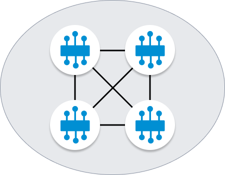
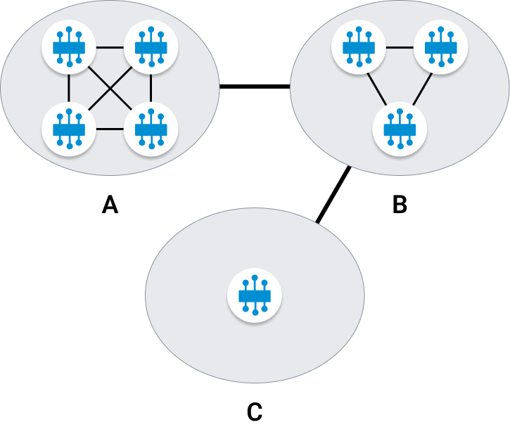

# Exercise 07 - Exchanging messages between Event Broker Services (Dynamic Message Routing)

In the SAP Integration Suite, advanced event mesh instance that we are using for this event has more than one event broker service but so far we've only published and consumed messages within a single event broker service. In this exercise, we will learn about Dynamic Message Routing and we will see messages being exchanged between brokers.

## Dynamic Message Routing (DMR)

Dynamic Message Routing is the underlying technology enabling message exchange between different event broker services (nodes) in an event mesh. DMR allows connected nodes to automatically determine how to forward event messages within the same site (horizontal scaling) or between sites (multi-site scaling) to exchange subscription information.

What's great about DMR is that the event brokers dynamically discover how to route messages between each other, without the need for manual configuration. A client application doesn't need to know the exact event broker service to which it should publish or subscribe messages. The event mesh takes care of routing the messages to the correct destination.

DMR is a key feature of the event mesh that allows you to scale your event mesh horizontally and across sites (multi-site). Let's explore this further.

<!-- TODO: Diagrams for horizontal and multi-site scaling -->
- Horizontal Scaling: When we are creating an event broker service, we can define the DMR cluster name. By default, a new event broker service is set up as a single-node cluster but they can be part of a DMR cluster by specifying the same DMR cluster name. In a DMR cluster, each node is connected to every other node in the cluster. These connections within the same cluster are called internal links.
  <p align = "center">
    <br/>
    <i>DMR - Horizontal scaling</i>
  </p>

- Multi-site scaling: In multi-site scaling, you connect two or more clusters. Connections between clusters are called external links and each cluster is connected via a gateway node in each cluster.
  <p align = "center">
    <br/>
    <i>DMR - Multi-site scaling</i>
  </p>

> The EDI CodeJam mesh, configured in the AEM instance that we are using as part of the event, is composed of three event broker services, each in a different region and each event broker service is a single-node cluster. This will be an example of multi-site scaling.

## DMR in action

We've seen how we can exchange messages within a single event broker service. Now, let's see how we can exchange messages between different event broker services without having to do any configuration. We will first subscribe to a topic in one event broker service (`APJ-IN-Broker`) and publish a message to that topic from another event broker service (`EU-North-Broker`) and we will see how the message is routed between the event broker services.

> 🔐 Your instructor will provide you the details to connect with the `solace-cloud-client` in the `APJ-IN-Broker`. In case you wonder why the `solace-cloud-client` user has been set up a password in the `APJ-IN-Broker` event broker service, it is just to demonstrate that we can update the password of the `solace-cloud-client` user and that the value shown in the event broker service - `Connect` tab doesn't necessarily reflect the real password. Compare the password provided by your instructor and the password show in the `Connect` tab.

<p align = "center">
    <br/>
    <i>Message exchange between event broker services</i>
</p>

👉 Navigate to Mission Control > Cluster Manager and open the broker manager for `APJ-IN-Broker`. Go to the `Advanced Try Me!` page and establish a connection in the subscriber section. Subscribe to the `codejam/edi/ce/[your-sap-community-username]/dmr` topic.

We've subscribed to the topic in the `APJ-IN-Broker` event broker service. Now, let's publish a message on the same topic but from the `EU-North-Broker` event broker service.

👉 Navigate to Mission Control > Cluster Manager and select the `EU-North-Broker`. Go to the `CodePen Try Me!` tab, establish a connection in the Publisher section and publish the message below to the `codejam/edi/ce/[your-sap-community-username]/dmr` topic.

```json
{
    "specversion": "1.0",
    "type": "com.sap.codejam.message",
    "source" : "https://github.com/SAP-samples/codejam-event-driven-architecture",
    "id" : "061F52DD-DEEB-4266-A0CE-5651845E9E7F",
    "time" : "2024-05-06T12:00:00Z",
    "datacontenttype": "application/json",
    "data": {
        "message": "DMR in action"
    }
}
```

You should have received the message published in the `EU-North-Broker` on the `APJ-IN-Broker` consumer. Under the hood what's happening is that the event broker informs others that it expects to receive messages for a particular topic. When a message is published on that topic, the event broker will automatically forward the message to the subscribers of that topic. In this case, the message is published in the `EU-North-Broker` event broker service and it is forwarded to the `APJ-IN-Broker` event broker service. No special configuration was required, the event mesh + DMR took care of routing the message to where it was expected.

## Message VPN Bridge

An alternative to using DMR is setting up a Message VPN Bridge. A Message VPN Bridge is a static configuration that allows you to define a connection between two event broker services. In a Message VPN, you need to configure topic subscriptions to define which events are exchanged between event broker services. This is useful when you want to control the message flow between two event broker services, for example, to restrict the flow of messages between two event broker services.

There is an optional exercise part of this CodeJam that covers configuring a Message VPN Bridge to connect two event broker services. If you are interested, you can find the exercise [TBC](TODO).

## Further Study

- Dynamic Message Routing - [link](https://help.pubsub.em.services.cloud.sap/Features/DMR/DMR-Overview.htm)
- Creating a Message VPN Bridge - [link](https://help.pubsub.em.services.cloud.sap/Cloud/Broker-Manager/vpn-bridge-ctc.htm)

---

If you finish earlier than your fellow participants, you might like to ponder these questions. There isn't always a single correct answer and there are no prizes - they're just to give you something else to think about.

1. What do you think will happen if we have set up two consumers, one in the `APJ-IN-Broker` and another in the `AMER-USEast-Broker` event broker services, both subscribed to the same topic `codejam/edi/ce/[your-sap-community-username]/dmr` and publish a message from `EU-North-Broker`?
2. Can you think of scenarios when you would use a Message VPN Bridge instead of DMR? What type of message would you rather exchange between event broker services using a Message VPN Bridge?

## Next

Continue to 👉 [Exercise 08 - Create a CloudEvent programmatically and publish it to AEM](../08-cloudevents-sdk/README.md)
