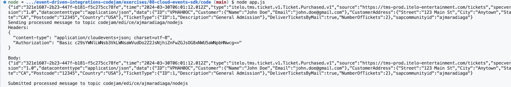

# Exercise 08 - Create a CloudEvent programmatically

Now that we are familiar with what a CloudEvent is, what a CloudEvent message looks like, and the different Event Formats available, let's see how we can create one programmatically.

## CloudEvents SDK

There are language-specific SDKs that can be used to create a message that complies with the CloudEvents standard. Below's a list of the different languages that an SDK is available for:

- [C#](https://github.com/cloudevents/sdk-csharp)
- [Go](https://github.com/cloudevents/sdk-go)
- [Java](https://github.com/cloudevents/sdk-java)
- [Javascript](https://github.com/cloudevents/sdk-javascript)
- [PHP](https://github.com/cloudevents/sdk-php)
- [PowerShell](https://github.com/cloudevents/sdk-powershell)
- [Python](https://github.com/cloudevents/sdk-python)
- [Ruby](https://github.com/cloudevents/sdk-ruby)
- [Rust](https://github.com/cloudevents/sdk-rust)

Using an SDK allows us to easily create a CloudEvent message and ensure that it follows the guidelines defined in the standard. As an example, below we are using the Python SDK to create the CloudEvent message for the Ticket Website that we've seen as an example previously.

```python
from cloudevents.http import CloudEvent
from cloudevents.conversion import to_binary
import requests

ticket_id = "VPHAH0OC"

# Create a CloudEvent
attributes = {
  "specversion": "1.0",
  "type": "com.itelo-entertainment.tms.Ticket.Purchased.v1",
  "source": "https://tms-prod.itelo-entertainment.com/tickets",
  "subject": ticket_id,
  "datacontenttype": "application/json",
}
data = {
    "ID": ticket_id,
    "BusinessPartner": "10003245",
    "TicketType": {
      "ID": 1,
      "Description": "General Admission",
    },
    "NumberOfTickets": 2,
  }
event = CloudEvent(attributes, data)

# Creates the HTTP request representation of the CloudEvent in binary content mode
headers, body = to_binary(event)

print(body)
```

You might have noticed that in the script above, we didn't include the `id` and `time` attributes in the CloudEvent message. This is because the SDK will automatically generate these attributes for us. If you want to set these attributes manually, you can do so by adding them to the `attributes` dictionary.

## Create a CloudEvent in Node.js

We will now create a CloudEvent message programmatically using the CloudEvents SDK available for Node.js. We will use the same example as before, the ticket website that generates an event after a customer purchases a ticket.

👉 Open the repository in Visual Studio Code. When opening, it will prompt you if you want to open it in a Dev Container

👉 Open the terminal, navigate to the exercise folder and install the dependencies

```bash
cd exercises/08-cloud-events-sdk
npm install cloudevents
```

👉 Open the file `index.js` and add the following code in the `Define the Cloud Event contents` section:

```javascript
const ticketId = "VPHAH0OC";

const type = "com.itelo-entertainment.tms.Ticket.Purchased.v1";
const source = "https://tms-prod.itelo-entertainment.com/tickets";
const datacontenttype = "application/json";
const sapcommunityid = "ajmaradiaga";

var data = {
  "ID": ticketId,
  "BusinessPartner": "10003245",
  "TicketType": {
    "ID": 1,
    "Description": "General Admission",
  },
  "NumberOfTickets": 2,
};
```

TODO: Brief explanation

👉 Add the following code in the `Create a CloudEvent` section:

```javascript
const emit = emitterFor(sendProcessedMessageToTopic, { mode: Mode.STRUCTURED });

// Create a new CloudEvent
const ce = new CloudEvent({ type, source, datacontenttype, data, sapcommunityid });
```

TODO: Brief explanation

👉 Add the following code in the `Send the CloudEvent` section:

```javascript
// Send it to the endpoint - encoded as HTTP binary by default but we've set it to structured
console.log(ce);

emit(ce);
```

TODO: Brief explanation

👉 Save the file and run the script by running on terminal `node index.js`

If everything went well, you should see the CloudEvent message printed in the console.

<p align = "center">
  <br/>
  <i>Output of program index.js</i>
</p>

## Summary

In this exercise, we learned how to create a CloudEvent message programmatically using the CloudEvents SDK for Node.js. We created a CloudEvent message for the Ticket Website example that we've seen previously.

## Further Study

* [CloudEvents specification](https://github.com/CloudEvents/spec)
* [JSON Event Format](https://github.com/cloudevents/spec/blob/main/cloudevents/formats/json-format.md)

---

If you finish earlier than your fellow participants, you might like to ponder these questions. There isn't always a single correct answer and there are no prizes - they're just to give you something else to think about.

1. Is it possible to batch CloudEvents in a single JSON document?
  <details>
    <summary>Hint 🔦</summary>
   Check out the CloudEvents primer - [https://github.com/cloudevents/spec/blob/main/cloudevents/primer.md](https://github.com/cloudevents/spec/blob/main/cloudevents/primer.md)
   <i>Batching multiple events into a single API call is natively supported by some protocols. To aid interoperability, it is left up to the protocols if and how batching is implemented. Details may be found in the protocol binding or the protocol specification.</i>
   </details>
2. Can you think of other scenarios where using an SDK to process a CloudEvent message would be beneficial?
3. In our code we specified the encoding Mode as `Structured`. What other modes are available? What if you send a message with a different mode? Can you spot the differences in the consumer UI? 

## Next

Continue to 👉 [Exercise 03 - ....](../03-/README.md)
