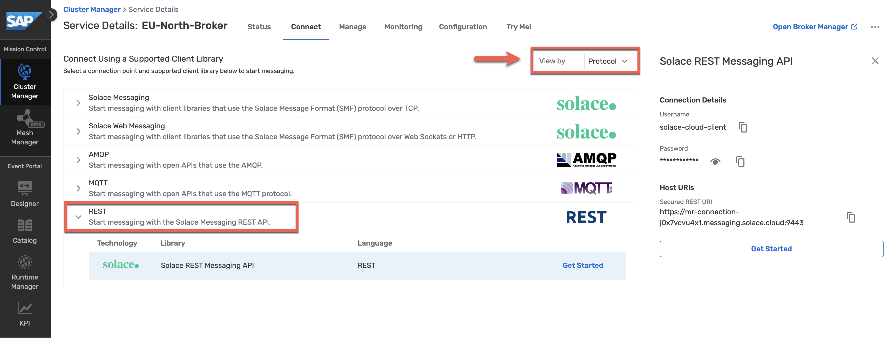
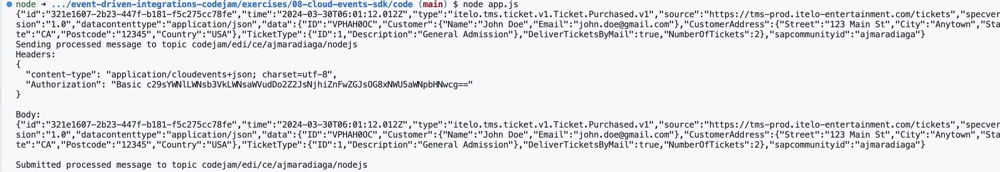

# Exercise 08 - Create a CloudEvent programmatically and publish it to AEM

Now that we are familiar with what a CloudEvent is, what a CloudEvent message looks like, and the different Event Formats available, let's see how we can create one programmatically and publish it to a topic in AEM. By the end of this exercise, we will achieve a communication scenario like the one below.

<p align = "center">
  <br/>
  <i>Creating a CloudEvent using Node.js and publishing it to AEM</i>
</p>

## CloudEvents SDK

There are language-specific SDKs that can be used to create a message that complies with the CloudEvents standard. Below's a list of the different languages that an SDK is available for:

- [C#](https://github.com/cloudevents/sdk-csharp)
- [Go](https://github.com/cloudevents/sdk-go)
- [Java](https://github.com/cloudevents/sdk-java)
- [Javascript](https://github.com/cloudevents/sdk-javascript)
- [PHP](https://github.com/cloudevents/sdk-php)
- [PowerShell](https://github.com/cloudevents/sdk-powershell)
- [Python](https://github.com/cloudevents/sdk-python)
- [Ruby](https://github.com/cloudevents/sdk-ruby)
- [Rust](https://github.com/cloudevents/sdk-rust)

Using an SDK allows us to easily create a CloudEvent message and ensure that it follows the guidelines defined in the standard. As an example, below we are using the Python SDK to create the CloudEvent message for the Ticket Website that we've seen as an example previously.

```python
from cloudevents.http import CloudEvent
from cloudevents.conversion import to_binary
import requests

ticket_id = "VPHAH0OC"

# Create a CloudEvent
attributes = {
  "specversion": "1.0",
  "type": "itelo.tms.ticket.v1.Ticket.Purchased.v1",
  "source": "https://tms-prod.itelo-entertainment.com/tickets",
  "subject": ticket_id,
  "datacontenttype": "application/json",
}
data = {
    "ID": ticket_id,
    "Customer": {
      "Name": "John Doe",
      "Email": "john.doe@gmail.com"
    },
    "CustomerAddress": {
      "Street": "123 Main St",
      "City": "Anytown",
      "State": "CA",
      "Postcode": "12345",
      "Country": "USA"
    },
    "TicketType": {
      "ID": 1,
      "Description": "General Admission",
    },
    "DeliverTicketsByMail": true,
    "NumberOfTickets": 2,
  }
event = CloudEvent(attributes, data)

# Creates the HTTP request representation of the CloudEvent in binary content mode
headers, body = to_binary(event)

print(body)
```

You might have noticed that in the script above, we didn't include the `id` and `time` attributes in the CloudEvent message. This is because the SDK will automatically generate these attributes for us. If you want to set these attributes manually, you can do so by adding them to the `attributes` dictionary.

## Create a CloudEvent in Node.js

We will now create a CloudEvent message programmatically using the CloudEvents SDK available for Node.js. We will use the same example as before, the ticket website that generates an event after a customer purchases a ticket.

👉 Open the CodeJam repository in SAP Business Application Studio

<p align = "center">
  <br/>
  <i>Open project in SAP Business Application Studio</i>
</p>

> To ensure that you are running the latest version of the repository, you can run the following commands in the terminal, from within the `/home/user/projects/event-driven-integrations-codejam` folder, to pull the latest changes: `git pull origin main`.

👉 Open the terminal, navigate to the exercise folder and install the dependencies

```bash
cd exercises/08-cloudevents-sdk/code
npm install
```

In this folder, we have a few files that we need to get familiar with:

- `package.json`: Contains the dependencies of our simple application.
- `.env.sample`: Contains the environment variables that we need to set.
- `app.js`: At the moment, the file is mostly empty. We are importing the CloudEvents SDK dependencies, loading some environment variables, and importing a module that is responsible for sending the CloudEvent message to a topic in SAP Integration Suite, advanced event mesh. This is the file that we will be working on.
- `emitter.js`: This file contains the code that sends the CloudEvent message to the topic in SAP Integration Suite, advanced event mesh. It uses the REST API available in AEM to send a message to a topic.

👉 Make a copy of the `.env.sample` file and name it `.env`. Place it in the same folder as where the `.env.sample` file resides. 

- Replace the placeholder values with the credentials available in the Cluster Manager > `EU-North-Broker` > `Connect` tab > `REST` collapsible section.
- Replace the [your-sap-community-username] placeholder with your SAP Community username in the topic.

<p align = "center">
  <br/>
  <i>EU-North-Broker REST API details</i>
</p>

👉 Open the file `emitter.js` and get familiar with it.

Although we don't need to change anything in this file, it is highly recommended to get familiar with it, so that you can see how the message is sent to the topic.

👉 Open the file `app.js` and get familiar with it.

Notice the different sections in the file. We will be adding code to the `Define the CloudEvent contents`, `Create a CloudEvent`, and `Send the CloudEvent` sections.

👉 Add the code below in the `Define the CloudEvent contents` section of the `app.js` file:

```javascript
const ticketId = "VPHAH0OC";

const type = "itelo.tms.ticket.v1.Ticket.Purchased.v1";
const source = "https://tms-prod.itelo-entertainment.com/tickets";
const datacontenttype = "application/json";
const sapcommunityid = "[your-sap-community-username]";

var data = {
  "ID": ticketId,
  "Customer": {
      "Name": "John Doe",
      "Email": "john.doe@gmail.com"
    },
    "CustomerAddress": {
      "Street": "123 Main St",
      "City": "Anytown",
      "State": "CA",
      "Postcode": "12345",
      "Country": "USA"
    },
    "TicketType": {
      "ID": 1,
      "Description": "General Admission",
    },
    "DeliverTicketsByMail": true,
    "NumberOfTickets": 2
};
```

Here we are defining the attributes and data that will be part of the CloudEvent message. We are using the same example as before, the ticket website that generates an event after a customer purchases a ticket. Note: Remember to update the `sapcommunityid` with your SAP Community username.

👉 Add the following code in the `Create a CloudEvent` section:

```javascript
const emit = emitterFor(sendProcessedMessageToTopic, { mode: Mode.STRUCTURED });

// Create a new CloudEvent
const ce = new CloudEvent({ type, source, datacontenttype, data, sapcommunityid });
```

The `emitterFor` function is part of the CloudEvents SDK and it is used to inform how we can send the CloudEvent message to the topic. The `Mode.STRUCTURED` parameter specifies that the CloudEvent message will be sent in structured mode. Once the emitter function is ready, we create a new CloudEvent by passing the attributes and data that we defined earlier.

👉 Add the following code in the `Send the CloudEvent` section:

```javascript
console.log(ce);

emit(ce);
```

Finally, we will print the CloudEvent message to the console and send it.

👉 Save the file and run the script by running on terminal 

```bash
node app.js
```

If everything went well, you should see the CloudEvent message printed in the console.

<p align = "center">
  <br/>
  <i>Output of program app.js</i>
</p>

> [!CAUTION]
> Note: If you see an error message, make sure that you have set the environment variables correctly in the `.env` file. Also, a solution for this exercise is available in the `.sap/code/08-cloudevents-sdk` folder.

> [!TIP]
> 💡 You can subscribe to the `codejam/edi/ce/[your-sap-community-username]/nodejs` topic, via the `Try Me!` page, to see the CloudEvent message being published.

## Summary

In this exercise, we learned how to create a CloudEvent message programmatically using the CloudEvents SDK for Node.js. We didn't only create a CloudEvent message for the Ticket Website example that we've seen previously but we also published it to a topic in AEM.

## Further Study

- CloudEvents specification - [link](https://github.com/CloudEvents/spec)
- JSON Event Format - [link](https://github.com/cloudevents/spec/blob/main/cloudevents/formats/json-format.md)

---

If you finish earlier than your fellow participants, you might like to ponder these questions. There isn't always a single correct answer and there are no prizes - they're just to give you something else to think about.

1. Is it possible to batch CloudEvents in a single JSON document?
    <details>
      <summary>⇟ Hint 🔦</summary>
    Check out the CloudEvents primer - [https://github.com/cloudevents/spec/blob/main/cloudevents/primer.md](https://github.com/cloudevents/spec/blob/main/cloudevents/primer.md)
    <i>Batching multiple events into a single API call is natively supported by some protocols. To aid interoperability, it is left up to the protocols if and how batching is implemented. Details may be found in the protocol binding or the protocol specification.</i>
    </details>
2. Can you think of other scenarios where using an SDK to process a CloudEvent message would be beneficial?
3. In our code, we specified the encoding Mode as `Structured`. What other modes are available? What if you send a message with a different mode? Can you spot the differences in the consumer UI? 

## Next

Continue to 👉 [Exercise 09 - Forward messages in Queue to REST Consumer](../09-rest-delivery-points/README.md)
