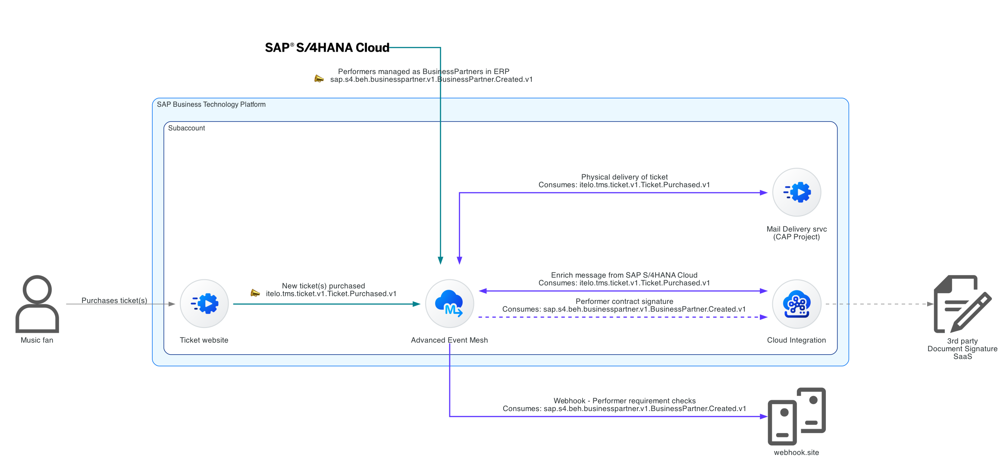
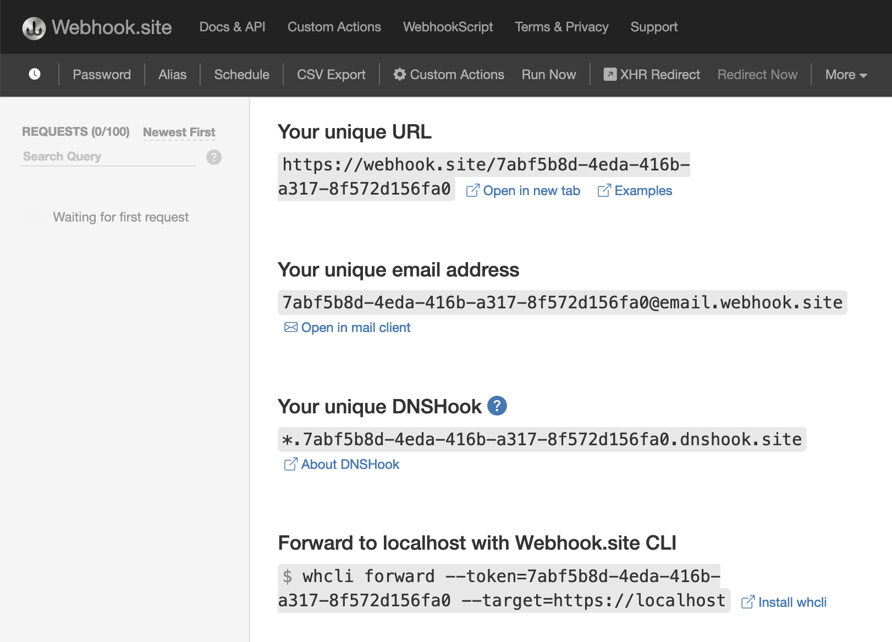
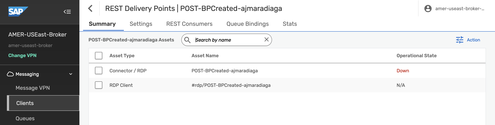
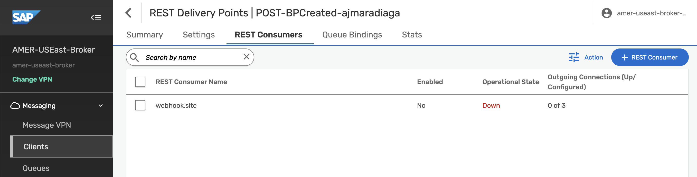
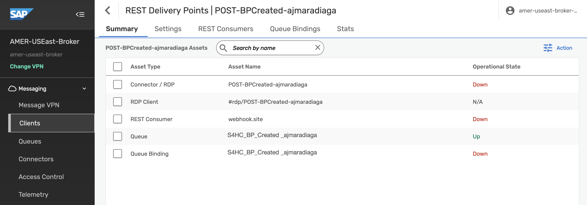
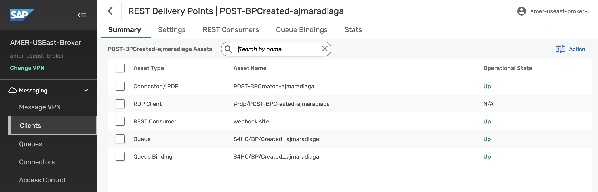
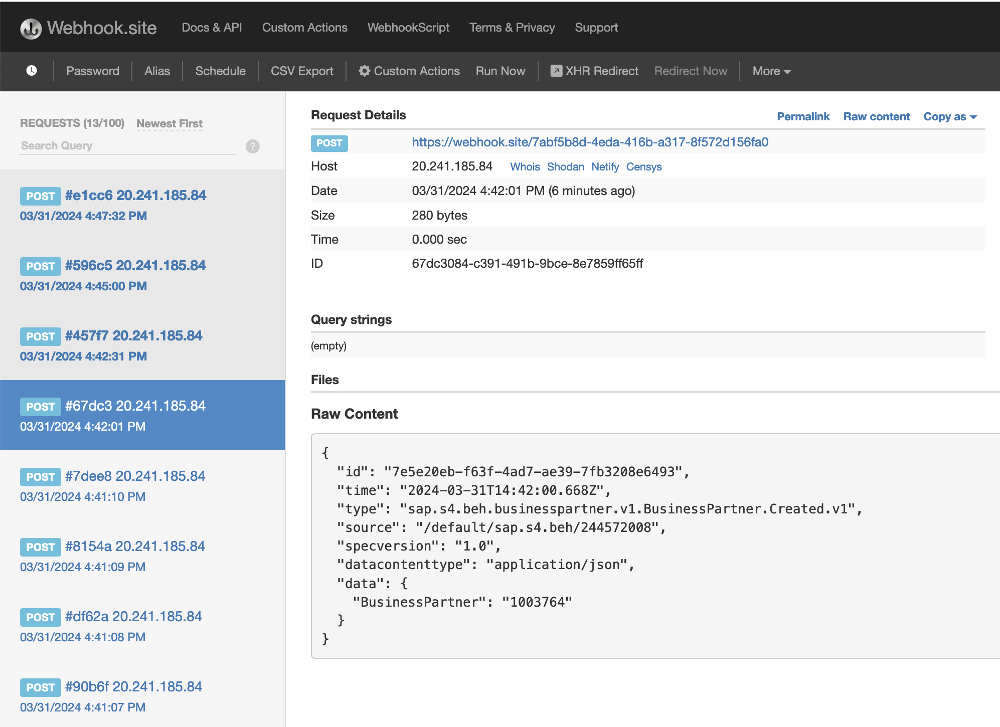

# Exercise 09 - Forward messages in Queue to REST Consumer

Now that we are familiar with the SAP Integration Suite, advanced event mesh, how we can publish and subscribe to events, and how we can exchange messages between Event Broker Services using Dynamic Message Routing, we will start tackling one of the requirements of our integration scenario.... trigger a business process in SAP Build Process Automation when a BusinessPartner is created in SAP S/4HANA Cloud.

There are scenarios where the target system/application can't consume messages directly from an event broker but we still want these systems/applications to be part of our event-driven world and react to events as they are produced. Fortunately, some of these systems might expose APIs (REST endpoints) through which we can notify them of an event. For these cases, we can leverage REST Delivery Points to forward messages from a queue to that system. For example, the integration between SAP S/4HANA Cloud and SAP Build Process Automation goes through SAP Event Mesh. In SAP Event Mesh we end up configuring a [webhook subscription](https://help.sap.com/docs/event-mesh/event-mesh/manage-webhook-subscriptions) to [forward the events received and start a process](https://help.sap.com/docs/build-process-automation/sap-build-process-automation/create-event-triggers) in SAP Build Process Automation.

If you remember the CodeJam's [integration scenario](../../../README.md#integration-scenario), we have an SAP S/4HANA Cloud System that generates events whenever a performer is added in the system (BusinessPartner) and we would like to trigger the "*Performer requirement checks*" process in SAP Build Process Automation. Although we will not be creating a process/interacting with SAP Build Process Automation in this CodeJam, it is important to understand the mechanism available to forward events to systems that expose REST endpoints. Therefore, we will forward messages from a queue to a REST consumer similar to how we would do it if we would like to forward the message to SAP Build Process Automation. From now on, we will refer to these types of systems as **REST consumers**.

> If you are interested in exploring how you can configure the webhook subscription mentioned above in SAP Event Mesh, you can check out this [SAP Tech Bytes: Deliver events from SAP EventMesh to SAP Build Process Automation](https://community.sap.com/t5/technology-blogs-by-sap/sap-tech-bytes-deliver-events-from-sap-eventmesh-to-sap-build-process/ba-p/13574547).

## REST Delivery Points (RDP)

A REST delivery point (RDP) is a provisioned object on an event broker service, that facilitates message delivery to REST consumers. The RDP can be bound to message queues to deliver messages from those queues to REST consumers. The RDP maintains a list of REST consumers, which are identified by their remote connection information.

In a previous exercise, we created a queue `codejam/edi/ce/[your-sap-community-id]/tickets`, which is subscribed to the topic `codejam/edi/ce/[your-sap-community-id]/tickets/*`. We will reuse this queue to forward messages from the queue to a REST consumer by creating a RDP. Let's go ahead and create an RDP.

## Prerequisites

Before we start creating our RDP, we will need to do a bit of a setup. First, we will "provision" a simple HTTP endpoint, where we will send the message. Then, we will clone a queue that we will use to forward messages to the REST consumer.

### webhook.site (HTTP endpoint)

For simplicity purposes our REST consumer will be a simple HTTP endpoint that will receive the messages from the queue. We will use a tool called [Webhook.site](https://webhook.site/) to create a temporary endpoint that will receive the messages. When you navigate to the website, you will be presented with a unique URL that you can use to receive the messages. Take a note of the unique URL as we will use it to configure the REST consumer.

     
    <i>webhook.site example</i>

### Clone queue

For this exercise, we will use the `AMER-USEast-Broker` event broker service. If you check out the queues available in this event broker service, you'll notice that there is a queue named `S4HC/BP/Created`. This queue is subscribed to the `sap/S4HANAOD/S4D/ce/sap/s4/beh/businesspartner/v1/BusinessPartner/Created/v1 ` topic, where the events for the BusinessPartner object created in SAP S/4HANA Cloud are being published. We will start by cloning this queue, so that we have a copy of the message received and we will forward messages from this queue to a REST consumer.

👉 Navigate to the `AMER-USEast-Broker` event broker service and click on the `Queues` link. You should see the `S4HC/BP/Created` queue. Select the check box, click on the **Action** button and select `Clone`. 

     
    <i>Clone S4HC/BP/Created queue in AMER-USEast-Broker</i>

You will be prompted to enter a name and if you want to clone its topic subscriptions.

👉 Enter a name for the cloned queue, e.g. `S4HC/BP/Created_[your_sap_community_id]` and select the `Children to Clone - Subscriptions` check box. Finalise by clicking the **Apply** button.

> There is a separate service which is simulating the creation of BusinessPartner objects in SAP S/4HANA Cloud. It will also be publishing the events to the `sap/S4HANAOD/S4D/ce/sap/s4/beh/businesspartner/v1/BusinessPartner/Created/v1` topic. Meaning that once you've created the cloned queue, you should start seeing messages in the cloned queue.

## Create a REST Delivery Point

Now that we've cloned the queue, we are ready to create a REST Delivery Point (RDP) to forward messages from the cloned queue to a REST consumer.

👉 Navigate to the `Clients` section in the `AMER-USEast-Broker`. Go to the `REST` tab and click the **+ REST Delivery Point** button. Enter a name, e.g. `POST-BPCreated-[your_sap_community_id]`, and click the **Create** button.

A simple configuration form will appear. No need to modify anything here. ***Do not enable the RDP yet***, leave the toggle button off and click the **Apply** button.

Once created, go to the RDP details page by clicking on the name of the RDP. You will see that there isn't much here yet, as we haven't configured the REST consumer details. We will do this now.

     
    <i>RDP details</i>

## Configure REST consumer

👉 Navigate to the `REST Consumers` tab and click on the **+ REST Consumer** button. Enter a name, e.g. `webhook.site`, and click the **Create** button.

     
    <i>Create REST consumer</i>

A configuration form will be displayed. Enter the details below and  ***do not enable the REST Consumer yet***, leave the toggle button off. 

| Field         | Value        |
| ------------- | ------------ |
| *Host*        | webhook.site |
| *Port*        | 443          |
| *TLS Enabled* | Yes          |

👉 Enter the details above and click the **Apply** button.

     
    <i>webhook.site REST consumer</i>

The newly created REST consumer will be listed in the REST Consumers tab. Now we need to configure the queue that we will bind to our RDP.

## Configure Queue binding

👉 Navigate to the `Queue Bindings` tab and click on the **+ Queue Binding** button. Select the queue previously created, e.g. `S4HC/BP/Created_[your-sap-community-id]`, and click the **Create** button.

     
    <i>Queue binding set up</i>

A simple configuration form will be displayed. In the Post Request target field you will need to enter the path (UUID) from the unique URL provided in webhook.site. For example, if the unique URL is https://webhook.site/7abf5b8d-4eda-416b-a317-8f572d156fa0, the value to enter in the Post Request target field is `/7abf5b8d-4eda-416b-a317-8f572d156fa0`. Notice that you will need to include the `/` at the beginning of the value.

| Field                       | Value                                                         |
| --------------------------- | ------------------------------------------------------------- |
| *Post Request Target*       | /[webhook-uuid], e.g. `/7abf5b8d-4eda-416b-a317-8f572d156fa0` |
| *Request Target Evaluation* | None                                                          |
| *Replace Target Authority*  | No                                                            |

👉 Enter the details above and click the **Apply** button.

## Enable the REST Consumer and RDP

Now that we have configured the REST consumer and the queue binding, we can enable the REST consumer and the RDP.

First, lets see all the object that we've configured.

👉 Navigate to the `Summary` tab and all the objects and their status will be listed. Notice that the only object in an operational state is the queue we created at the beginning of the exercise.

     
    <i>RDP object</i>

👉 Navigate to the `REST Consumers` tab, click on the name of the REST consumer, e.g. `webhook.site`, click the **Edit** button on the top right hand side and enable the REST consumer by toggling the Enabled setting. Click the **Apply** button.

Now we are ready to enable our RDP.

👉 Navigate to the `Summary` tab, click on the name of the REST consumer, e.g. `POST-BPCreated-[your-sap-community-id]`, click the **Edit** button on the top right hand side and enable the RDP by toggling the Enabled setting. Click the **Apply** button.

Once we enable the RDP, if we navigate to the `Summary` tab, we should see that all the objects are in an operational state.

     
    <i>RDP objects - All operational</i>

As mentioned previously, there is a separate service which is simulating the creation of BusinessPartner objects in SAP S/4HANA Cloud. Now that you've enabled the RDP, you should see messages in webhook.site. 

👉 Check the messages received in webhook.site and you should see the messages received from the cloned queue.

     
    <i>Received messages in webhook.site</i>

## Summary

In this exercise, we have learned how to create a REST Delivery Point (RDP) to forward messages from a queue to a REST consumer. We used a simple HTTP endpoint (thanks to webhook.site) to receive the messages from the queue. Now we know a mechanism to enable systems that expose REST endpoints to "react" to events produced by an event broker service.

## Further Study

* Managing REST Delivery Points - [link](https://docs.solace.com/Services/Managing-RDPs.htm)
* REST Consumer Authentication Schemes - [link](https://docs.solace.com/Services/Managing-RDPs.htm#configuring-REST-consumer-authentication-schemes)

---

If you finish earlier than your fellow participants, you might like to ponder these questions. There isn't always a single correct answer and there are no prizes - they're just to give you something else to think about.

1. What if you would need to transform or enrich the message before sending it to the REST consumer? How would you do it?
2. Can you think of a system within your company that exposes REST endpoints and could benefit from being part of an event-driven architecture?
3. Which authentication schemes are available for a REST consumer?

## Next

Continue to 👉 [Exercise 10 - Consuming messages from CAP project](../10-consume-message-from-CAP/README.md)
