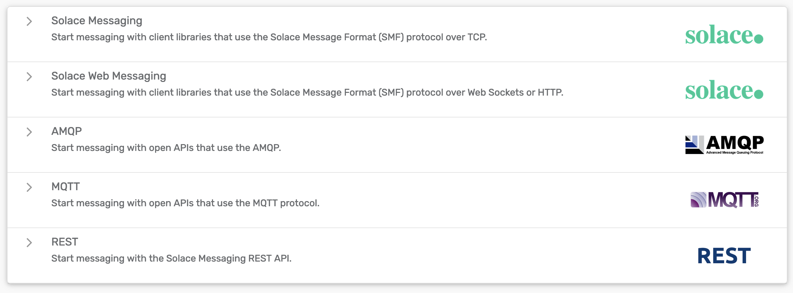
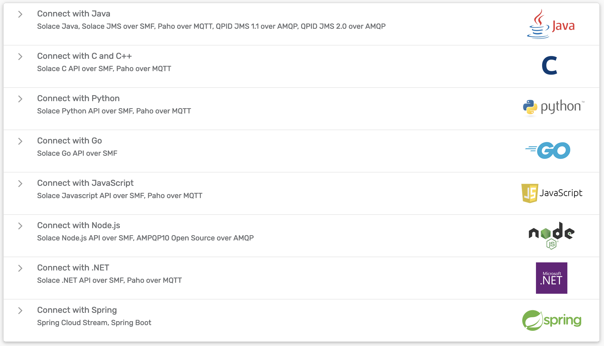
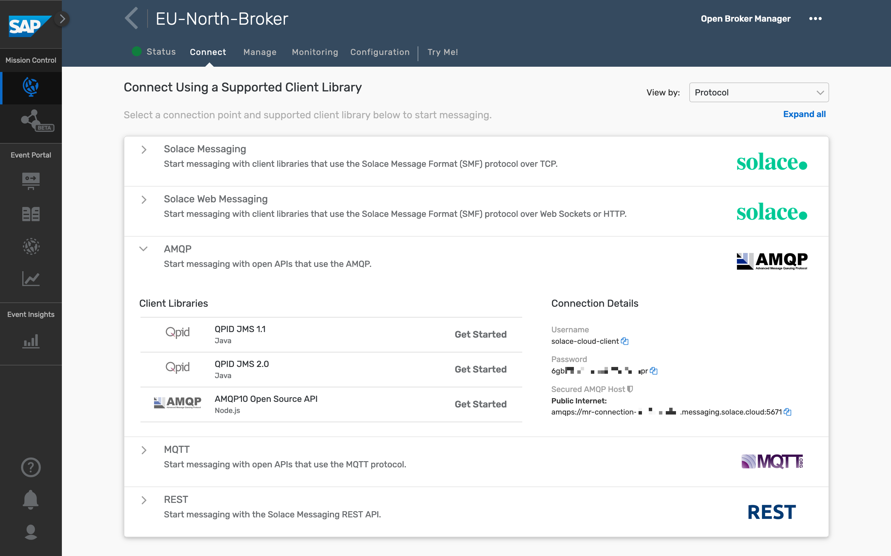
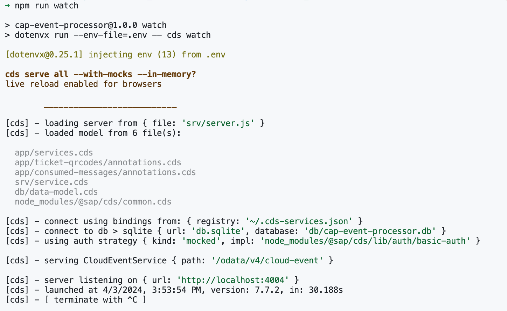
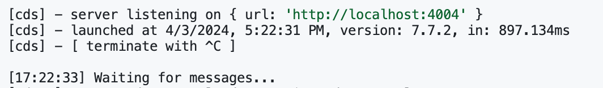
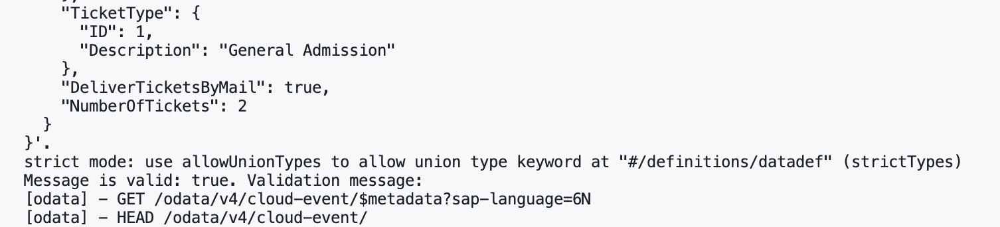
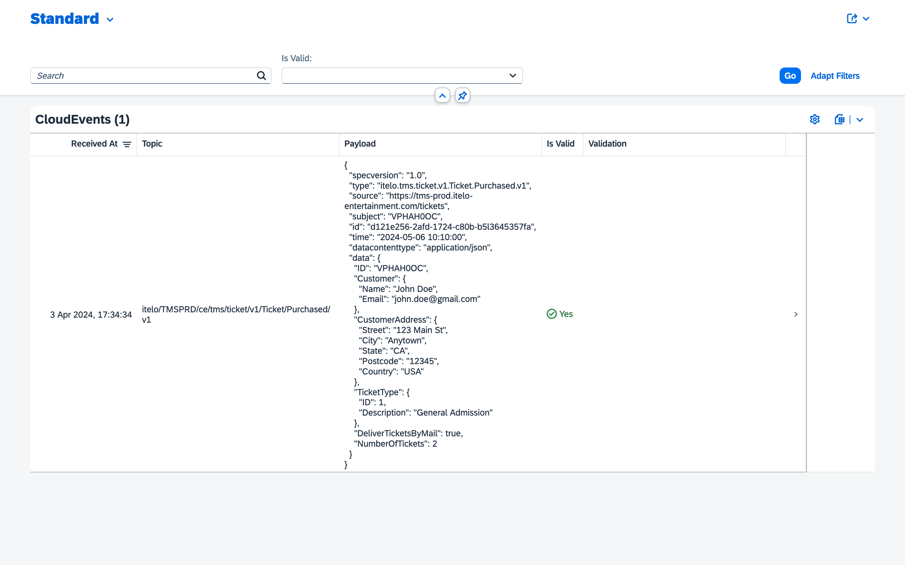
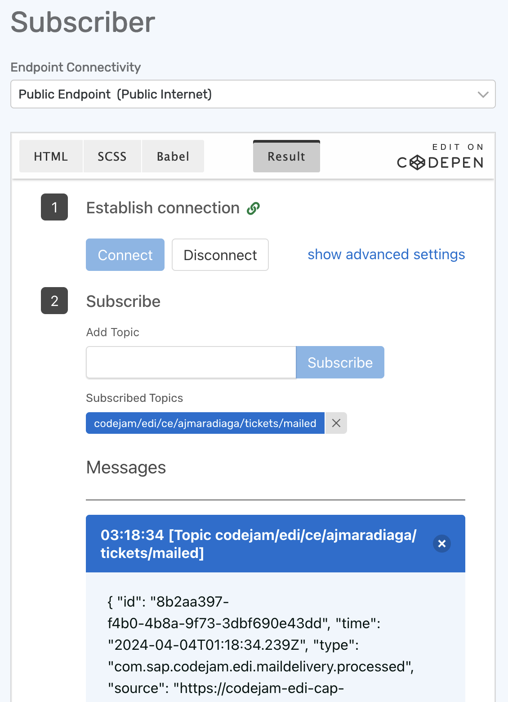

# Exercise 10 - Consuming messages from CAP project

We are starting to tackle our integration scenario and so far we've been able to forward events from SAP S/4HANA Cloud to a REST endpoint. We've also been able to create a CloudEvent message programmatically and publish it to a topic in SAP Integration Suite, advanced event mesh. Now, we will consume the CloudEvent message from the CAP service that's responsible for generating the information required for the physical delivery of the ticket purchased (Mail Delivery service in the diagram below).


There is a separate service that simulates the tickets purchased events from the ticket website. It will also be publishing the purchased tickets events to `itelo/TMSPRD/ce/tms/ticket/v1/Ticket/Purchased/v1` topic. We will consume these events from a CAP project. Below you can see a sample event message generated by the service.

```json
{
  "specversion": "1.0",
  "id": "e6406e03-c9ea-4cdc-be32-a8ed9d2012a3",
  "source": "https://tms-prod.itelo-entertainment.com/tickets",
  "type": "itelo.tms.ticket.v1.Ticket.Purchased.v1",
  "datacontenttype": "application/json",
  "subject": "TIC007527",
  "time": "2024-04-07T06:08:13.689963+00:00",
  "data": {
    "ID": "TIC007527",
    "Customer": {
      "Name": "Henriette Dussen van-Rust",
      "Email": "davidsstefania@web.de"
    },
    "CustomerAddress": {
      "Street": "489 Burkard-Hartung-Weg 608",
      "City": "Teterow",
      "State": "Hamburg",
      "Postcode": "51327",
      "Country": "DE"
    },
    "TicketType": { "ID": 1, "Description": "General Admission" },
    "DeliverTicketsByMail": true,
    "NumberOfTickets": 2
  }
}
```

## Connecting to SAP Integration Suite, advanced event mesh from the CAP project

We can use different protocols to connect with AEM, this will depend on our needs and the type of service/device that will be publishing/consuming messages. The event broker provides a foundation for multi-protocol and standards eventing including Solace Message Format (SMF), JMS1.1, MQTT3.11, REST, and AMQP1.0.

<p align = "center">
  <br/>
  <i>Supported protocols</i>
</p>

Also, there are many connectivity options available depending on your favourite programming language. 
> Check out the tutorials available for the different programming languages - https://tutorials.solace.dev/.

<p align = "center">
  <br/>
  <i>Client Libraries - Programming Languages</i>
</p>

To keep things simple for this exercise, we will be using the [AMQP 1.0](https://www.amqp.org/) protocol to connect and consume messages from a queue in AEM. As our service will also publish messages, in that case, we will use the REST protocol. This uses standard HTTP, which we are all familiar with.

## Create a queue in the EU-North-Broker


👉 Access the `EU-North-Broker` and create a new queue with the following name: `codejam/edi/[your-sap-community-id]/Tickets/Purchased`. Once created, subscribe to the `itelo/TMSPRD/ce/tms/ticket/v1/Ticket/Purchased/v1` topic.

We've created the queue that we will be connecting from the CAP project to consume the events.

## Get familiar with the CAP project

We will start getting familiar with the CAP project that is included within the assets project of this exercise. The project contains a data model, a couple of SAP Fiori Elements apps and some logic to consume data from a queue.

👉 Open the CodeJam repository in SAP Business Application Studio

> Instructions on how to clone the repository are included in the [prerequisites](../../../prerequisites.md#sap-business-application-studio).

<p align = "center">
  <br/>
  <i>Open project in SAP Business Application Studio</i>
</p>

> To ensure that you are running the latest version of the repository, you can run the following commands in the terminal, from within the `/home/user/projects/event-driven-integrations-codejam` folder, to pull the latest changes: `git pull origin main`.

👉 Open the terminal, navigate to the exercise folder and install the dependencies

```bash
$ cd exercises/10-consume-message-from-CAP/code/edi-codejam-cap-processor
$ npm install

# Generate the DB used by the CAP service
$ cds deploy
```

In this folder, we have a few files that we need to get familiar with:
- `package.json`: Contains the dependencies of our CAP project.
- `.env.sample`: Contains the environment variables that we need to set.
- `srv/cloudEventsSchema.js`: Contains a JSON schema of the CloudEvents specification which we are going to use to validate the incoming events.
- `srv/queueConsumer.js`: This file is responsible for setting up the AMQP client and create the receiver.
- `srv/server.js`: At the moment, the file is mostly empty. We are importing the CloudEvents SDK dependencies, loading some environment variables, and importing a module that is responsible for sending the CloudEvent message to a topic in SAP Integration Suite, advanced event mesh. This is the file that we will be working on the most.

We have two entities in the data model, `db/data-model.cds` file: `ConsumedMessage` and `QRCode`. The CAP service will use a simple SQLite backend. In the ConsumedMessage we will store all events received from the queue. In the QRCode entity, we will store the QR code that will be generated for the ticket purchased.

The idea is that when our CAP service receives an event, we will validate that the event received follows the CloudEvents specification, process the message and generate a QRCode based on the contents of the message. We will implement the logic on what to do when consuming an event from a queue and we will pass that logic to the QueueConsumer.

👉 Open the file `srv/queueConsumer.js` and get familiar with it.

Although we don't need to change anything in this file, it is highly recommended to get familiar with it, so that you can see how the events are consumed using the [AMQP package](https://www.npmjs.com/package/amqp).

## Environment Variables

We will start by setting up the environment variables that we will use in the CAP project. This is so that we can run the project as is and it will keep running as we make changes.

👉 Make a copy of the `.env.sample` file and name it `.env`. Place it in the same folder as where the `.env.sample` file resides. 
- Replace the placeholder values with the credentials available in the Cluster Manager > `EU-North-Broker` > `Connect` tab > `AMQP` collapsible section.
- Replace the [your-sap-community-id] placeholder with your SAP Community ID in the topic.

<p align = "center">
  <br/>
  <i>EU-North-Broker AMQP details</i>
</p>

👉 Open the file `srv/server.js` and get familiar with it.

Notice the different sections in the file. We will be adding code to the `Validate the message against a CloudEvents schema`, `Store the message in the database`, and `Set up Queue Consumer` sections. This is where we will be adding the logic to validate the incoming message, store it in the database and set up the queue consumer. 

If we've replaced the environment variables in the `.env` file, we can now run the CAP project.

👉 In the terminal, run `npm run watch`. 

<p align = "center">
  <br/>
  <i>Output of npm run watch</i>
</p>

The project will start and you should see in terminal an output like the one above. Also, there will now be a `.db` file within the db folder and you can access the Fiori Element apps via `http://localhost:4004`.

## Set up the Queue Consumer

We will start by setting up the connection to the queue and consuming the messages.

👉 Add the code below in the `Set up Queue Consumer` section of the `srv/server.js` file. Save the file:

```javascript
var solaceHostname = `${process.env.SOLACE_AMQP_PROTOCOL}://${process.env.SOLACE_AMQP_USERNAME}:${process.env.SOLACE_AMQP_PASSWORD}@${process.env.SOLACE_AMQP_HOST}:${process.env.SOLACE_AMQP_PORT}`;

var queueConsumer = new QueueConsumer(processMessage)
  .host(solaceHostname)
  .queue(process.env.SOLACE_AMPQ_QUEUE_NAME)
  .logger(cds.log("AMPQConsumer"));

// the next statement blocks until a message is received
queueConsumer.receive();
```

If there are no messages in the queue then it will block until a message is received and there will be a message in terminal stating that it is waiting for messages.

<p align = "center">
  <br/>
  <i>Waiting for messages</i>
</p>

If not, then it will process the messages available in the queue and at this stage it will just print out the message in terminal.

> Don't worry if we are "losing" this messages and not processing them properly. This is intended and we will add the logic to process the message in the next steps.

## Validate the message against a CloudEvents schema

Now that we've set up the connection to the queue and that we are receiving the events. Let's go ahead and validate that these are valid CloudEvents messages.

👉 Add the code below in the `Validate the message against a CloudEvents schema` section of the `srv/server.js` file. Save the file:

```javascript
try {
    topic = message.properties.to;
    payload = message.body;

    // Validate that the body is a JSON
    var body = JSON.parse(message.body);

    // Check for required CloudEvent elements
    messageId = "id" in body ? body.id : null;
    source = "source" in body ? body.source : null;
    specversion = "specversion" in body ? body.specversion : null;
    type = "type" in body ? body.type : null;
    ceData = "data" in body ? body.data : null;

    const validate = ajv.compile(cloudEventsSchema);
    const isMessageBodyCloudEvent = validate(body);

    if (!isMessageBodyCloudEvent) {
      LOG.error(
        "Invalid CloudEvent message:",
        ajv.errorsText(validate.errors)
      );
      validationMessage =
        "Invalid Payload: Payload is not a CloudEvent message. Schema validation: " +
        ajv.errorsText(validate.errors);
    }
  } catch (error) {
    if (error instanceof SyntaxError) {
      LOG.error("SyntaxError", error.message);
      validationMessage = "Invalid JSON: " + error.message;
    } else {
      var errorDescription = error.name + ": " + error.message;
      LOG.error(errorDescription);
      validationMessage = errorDescription;
    }
  }

  const isValid = validationMessage == "" ? true : false;

  LOG.info('Message is valid: ', isValid, 'Validation message: ', validationMessage);
```

The service will process the messages available in the queue and at this stage, it will print out if the message is valid or not and a validation message.

<p align = "center">
  <br/>
  <i>CloudEvent schema validation</i>
</p>

## Store the message in the database

Now that we are validating the incoming messages, let's go ahead and store the valid messages in the database.

👉 Add the code below in the `Store the message in the database` section of the `srv/server.js` file. Save the file:

```javascript
var entry = {
    topic: topic,
    messageId: messageId,
    source: source,
    specversion: specversion,
    type: type,
    payload: payload,
    isValid: isValid,
    validationCriticality: isValid ? 3 : 1,
    validationMessage: validationMessage,
  };

  try {
    INSERT.into(messages)
      .entries(entry)
      .then((x) => {
        LOG.info(x);
        LOG.info("Message has been inserted into the database", entry.messageId);
      });

    if (isValid && ceData != null) {
      // Calculate qrcode
      var ticketId = ceData.ID;

      LOG.info("Ticket Id: ", ticketId);

      var QRCode = require("qrcode");

      QRCode.toDataURL(ticketId, function (err, url) {
        LOG.info("QRCode data URL:" , url);

        // Print the type of url
        LOG.info(typeof url);

        if (err) {
          LOG.error(err);
          return;
        } else {
          var qrcodeEntry = {
            ticketId: ticketId,
            messageId: messageId,
            dataURL: url,
          };

          INSERT.into(qrcodes)
            .entries(qrcodeEntry)
            .then((x) => {
              LOG.info(x);
              LOG.info("QRCode has been inserted into the database");
            });
        }
        
        // Send the processed message to the topic
        publishMessageToTopic(qrcodeEntry, process.env.SOLACE_REST_PUBLISH_TOPIC);
      });
    }
  } catch (error) {
    var errorDescription = error.name + ": " + error.message;
    LOG.error(errorDescription);
    validationMessage = errorDescription;
  }
```

We can check the messages stored in the database by accessing the Fiori Element app via `http://localhost:4004`:
- Consumed Messages: `http://localhost:4004/consumed-messages/webapp/index.html`
- QR Codes: `http://localhost:4004/ticket-qrcodes/webapp/index.html`

<p align = "center">
  <br/>
  <i>Consumed Messages</i>
</p>

## Create CloudEvent message and publish to topic

We are storing the messages in the database and generating a QR code based on the ticket ID. Let's go ahead and send the processed message to a topic in SAP Integration Suite, advanced event mesh.

👉 Add the code below in the `Create CloudEvent message and publish to topic` section of the `srv/topicPublisher.js` file. Save the file:

```javascript
const ce = new CloudEvent({
    specversion: "1.0",
    type: "com.sap.codejam.edi.maildelivery.processed",
    source: "https://codejam-edi-cap-processor.cfapps.eu10.hana.ondemand.com/",
    data: payload
  });

  const { headers, body } = HTTP.structured(ce);

  // Add Authorization to headers
  headers["Authorization"] = `Basic ${base64Credentials}`;

  const postData = JSON.stringify(JSON.parse(body), null, 2);

  LOG.debug("Headers: ", JSON.stringify(headers, null, 2));
  LOG.debug("Body: ", postData);

  const options = {
    hostname: process.env.SOLACE_REST_HOST,
    port: process.env.SOLACE_REST_PORT,
    path: `/${topic}`,
    method: "POST",
    headers: headers,
  };
```

We've created a new CloudEvent message with the processed data but we still need to call the publishMessageToTopic function in our `srv/server.js` file.

👉 Finally, uncomment the `publishMessageToTopic(qrcodeEntry, process.env.SOLACE_REST_PUBLISH_TOPIC);` line in the `srv/server.js` file to send the processed message to the topic.

## Validate the processed message in `EU-North-Broker`

If you've followed all the steps correctly, you should be able to see the processed messages in the `EU-North-Broker`.

👉 Access the `EU-North-Broker` and subscribe to the `codejam/edi/ce/[your-sap-community-id]/tickets/mailed` topic, where the processed messages are being published. You should start seeing messages being processed by the CAP processor service.

<p align = "center">
  <br/>
  <i>CAP Processor - Tickets Mailed</i>
</p>

## Summary

There are lots of moving parts in this exercise.... we created a queue, set up the connection to the queue, validated the incoming messages, stored the messages in the database, generated a QR code based on the ticket ID, and sent the processed message to a topic in SAP Integration Suite, advanced event mesh. Although there are many steps in the exercise, I hope you can see how easy it is to consume messages from a queue and process them in a CAP project.

## Further Study

* CAP Documentation - [link](https://cap.cloud.sap/docs/)
* AMQP package documentation in npm - [link](https://www.npmjs.com/package/amqp)
* How Apps Interact with PubSub+ Messaging Components - [link](https://docs.solace.com/API/Component-Maps.htm)
* Solace REST Example Code - [link](https://docs.solace.com/API/RESTMessagingPrtl/Solace-REST-Example.htm)
* REST Messaging Protocol - [link](https://docs.solace.com/API/RESTMessagingPrtl/Solace-REST-Overview.htm)

---

If you finish earlier than your fellow participants, you might like to ponder these questions. There isn't always a single correct answer and there are no prizes - they're just to give you something else to think about.

1. Which other protocols could you use to connect to the SAP Integration Suite, advanced event mesh?
2. Why would you prefer to use the SMF protocol over the AMQP protocol?
3. What would be an advantage of using the AMQP protocol over the SMF protocol?

## Next

Continue to 👉 [Exercise 11 - Process messages from Cloud Integration](../11-aem-cloud-integration-adapter/README.md)
