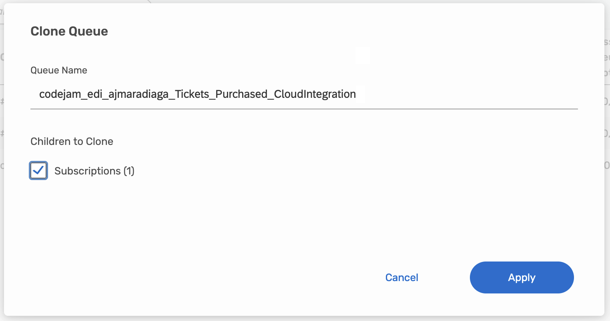
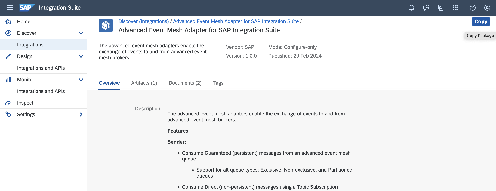
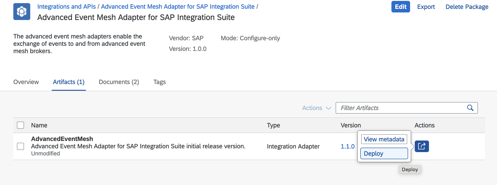
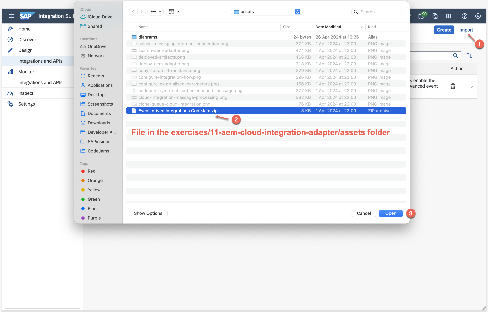
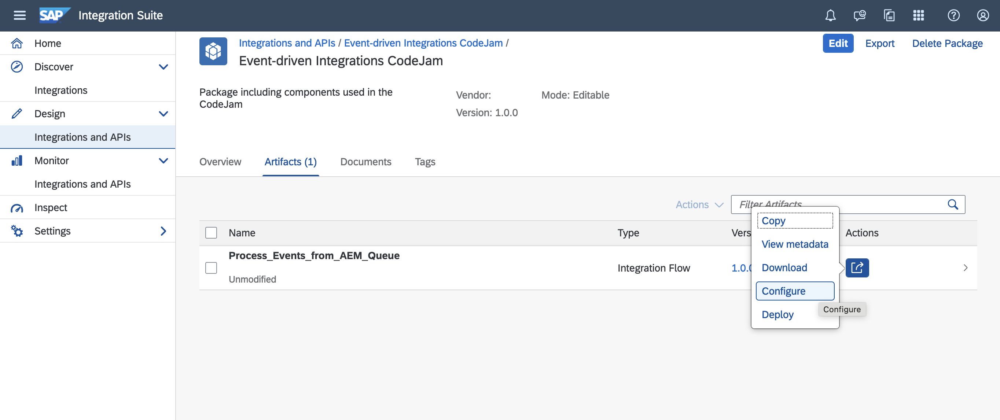
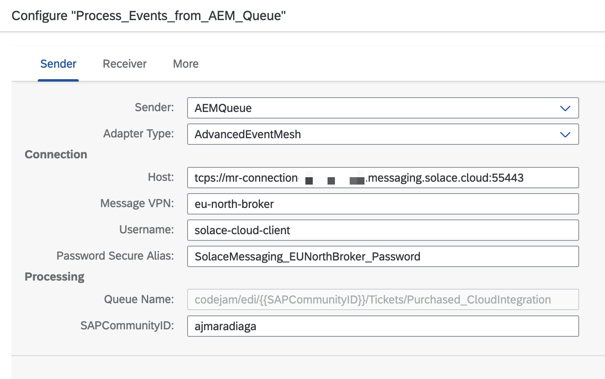
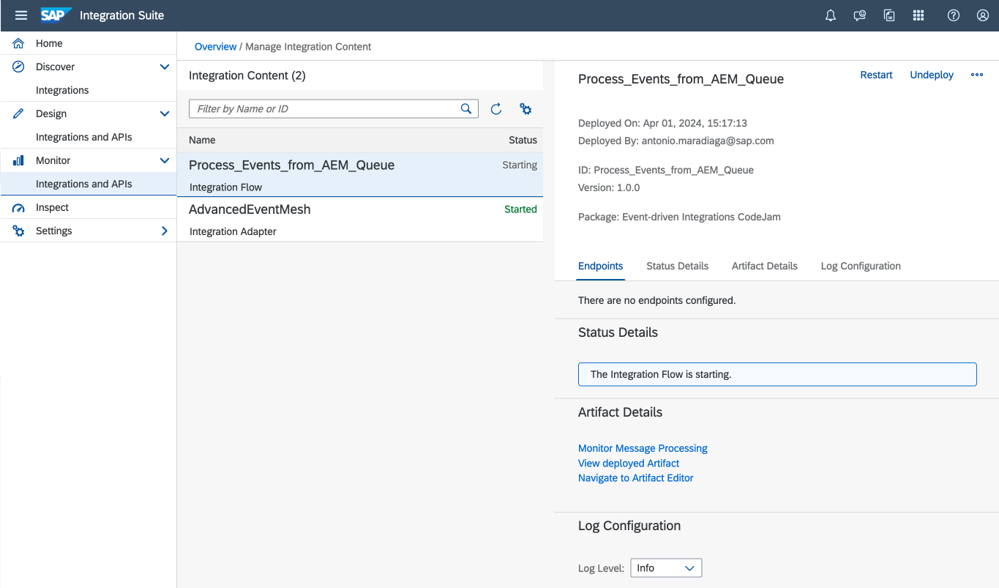
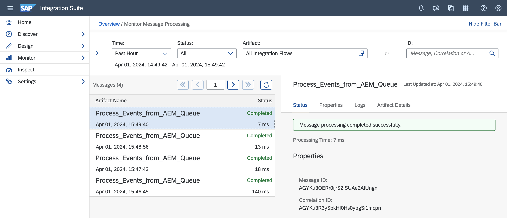
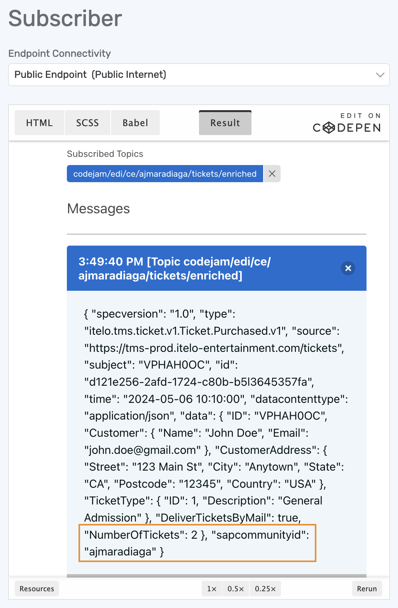

# Exercise 11 - Process messages from Cloud Integration

In previous exercises, we've communicated with SAP Integration Suite, advanced event mesh (AEM) using the following protocols:

- Solace Web Messaging protocol, via the `Try Me!` UI.
- REST protocol, from the Node.js application in exercise 08.
- AMQP protocol, from the CAP project in exercise 10.

Now, in this exercise, we will consume the events from AEM using the Cloud Integration service. We will leverage the [AEM adapter](https://hub.sap.com/integrationadapter/AdvancedEventMesh) available and use it in an integration flow to consume the purchased tickets events from a queue in AEM (the AEM adapter uses the Solace Messaging protocol). We will then enrich the message and publish it to a topic. As explained in the previous exercise, there is a separate service that simulates the ticket purchased events from the ticket website. We will extend the consumption of those events in this exercise.

> The goal of this exercise is not to create an integration flow from scratch but to get familiar with the AEM integration adapter and understand the connectivity mechanism between AEM and Cloud Integration.

Before we get started, make a note of the connection details for the Solace Messaging adapter available in the `EU-North-Broker` service, as we will be using these details in the integration flow configuration.

## Queue for Cloud Integration

👉 Access the `EU-North-Broker` and clone the queue created in the previous exercise and name it: `codejam/edi/[your-sap-community-username]/Tickets/Purchased_CloudIntegration`. Make sure to also clone the subscriptions. 

     
    <i>Queue for Cloud Integration</i>

We've created a separate queue, which we will be connecting from Cloud Integration, to also consume the purchased tickets events published to the `itelo/TMSPRD/ce/tms/ticket/v1/Ticket/Purchased/v1` topic.

## Set up components in Cloud Integration

Before we can receive message from the queue, we need to set up a few things in Cloud Integration:

1. Create a secure parameter for the Solace Messaging password.
2. Import the Advanced Event Mesh adapter from the SAP Business Accelerator Hub.
3. Import the integration flow available in the assets folder.

### Create a secure parameter for the Solace Messaging password

👉 Go to your SAP Integration Suite instance and create a secure parameter in `Monitor` > `Integration and APIs` > `Manage Security` section > `Security Material`. Then from the `Create` menu select `Secure Parameter`. Provide the details below and deploy.

| Field            | Value                                                                                        |
| :---------------- | :-------------------------------------------------------------------------------------------- |
| Name             | SolaceMessaging_EUNorthBroker_Password                                                       |
| Description      | Password for Solace Messaging in EU-North-Broker                                             |
| Secure Parameter | *Password field in the Connect > Solace messaging section* |

Take note of the secure parameter name as we will be using it in the integration flow when configuring the flow before deployment.

### Import the Advanced Event Mesh adapter

> Importing the Advanced Event Mesh adapter from the SAP Business Accelerator Hub to the tenant might not be always necessary, as the adapter might be already available in the tenant. For example, if you have already used the adapter in a different integration flow, then the adapter will be available in the tenant. Also, the first time you set up a Sender/Receiver to use the AdvancedEventMesh adapter, it will automatically get the adapter from the SAP Business Accelerator Hub and deploy it in the tenant. Not the case in this exercise as we are importing an existing integration flow and we aren't setting up the connections from scratch. The steps below are provided for the case when the adapter is not available in the tenant.

👉 Go to your SAP Integration Suite instance and navigate to `Discover` > `Integrations`, search for `Advanced Event Mesh` and select the Advanced Event Mesh adapter for SAP Integration Suite. 

👉 Once in the adapter details, click on the `Copy` button in the top right-hand corner. This action will copy the adapter to your SAP Integration Suite tenant.

Now the AEM adapter is in the tenant and you can see that there is a new integration package called `Advanced Event Mesh Adapter for SAP Integration Suite`, within its artifacts is the adapter itself. Let's deploy it.

👉 Click the `Actions` button for the integration adapter and select `Deploy`.

> You will be able to see the deployed content in `Monitor` > `Integrations and APIs` >  `Manage Integration Content` > `All`.

### Import the integration flow

Now we will go ahead and import the integration flow available in the assets folder.

👉 Go to your SAP Integration Suite instance and navigate to `Design` > `Integrations and APIs` and click the **Import** button in the top right hand corner, select the `Event-driven Integrations CodeJam.zip` file that's in the exercises/11-aem-cloud-integration-adapter/assets folder and click the Open button.

     
    <i>Import integration package file</i>

Once imported, you will see the integration flow in the `Artifacts` tab of the integration package. 

## Get familiar with the AEM adapter and the integration flow

As stated at the beginning, the integration flow is very simple, it consumes the purchased tickets events from the queue in AEM, enriches the message and publishes it to a topic.

🧭 Take some time to explore the integration flow itself...Some ideas: 

- Check the tabs and configuration options available in the sender adapter (Connection, Processing).
- Check the tabs and configuration options available in the sender adapter (Connection, Processing, Message properties).
- What are we doing in the Groovy script that's enriching the message?
- Which is the Transport Protocol used by the adapters?
- Which is the Message Protocol used by the adapters?

Now that you are familiar with the integration flow, let's configure it.

## Configure the Integration Flow

👉 Click the `Actions` button for the integration flow and `Configure` its externalised parameters with the details below:

| Section | Field | Value | 
| :------- | :----- | :----- |
| Sender | Host | *Secured SMF Host field in the Connect > Solace messaging section* |
| Sender | Message VPN | *Message VPN field in the Connect > Solace messaging section* |
| Sender | Username | *Username field in the Connect > Solace messaging section* |
| Sender | Password | `SolaceMessaging_EUNorthBroker_Password` |
| Sender | SAPCommunityID | `[your-sap-community-username]` |

## Deploy the Integration Flow

👉 Once you've configured the externalised parameters, click the `Deploy` button to deploy the integration flow.

If you are using SAP Integration Suite in the BTP trial environment, it might take a few minutes to deploy the integration flow. Also, you might get an error message stating that it has failed to deploy. You can safely ignore this error message if it is the first time deploying as it just takes some time the first time you deploy an integration flow. 

> You can monitor the deployment status in `Monitor` > `Integrations and APIs` >  `Manage Integration Content` > `All` tile or in the integration flow itself under the `Deployment status` tab.

     
    <i>Monitor deployed artifacts</i>

## Monitor integration flow and produced messages

Now our integration flow is ready to process the purchased tickets events from AEM. The service which is simulating the ticket purchased events is continuously sending events to the `itelo/TMSPRD/ce/tms/ticket/v1/Ticket/Purchased/v1` topic and in a matter of seconds we will see our integration flow processing the events.

👉 Go to the `Monitor` > `Integrations and APIs` > `Monitor Message Process` > `All Artifacts` tile and see the messages being processed.

     
    <i>Cloud Integration - Message processing</i>

Also, we can check the produced messages in the `EU-North-Broker` service by subscribing to the topic where the integration flow is publishing the messages.

👉 Go to the `CodePen Try Me!` UI in the `EU-North-Broker` event broker service and subscribe to the `codejam/edi/ce/[your-sap-community-username]/tickets/enriched` topic. Same as before, you will receive "enriched" messages published on the topic in a matter of seconds.

     
    <i>CodePen TryMe! Subscriber - Enriched message</i>

## Summary

You've made it to the last exercise of this CodeJam. Congratulations!!! 🎉 🙌. This is no easy feat as there is a lot to read/learn/process in the CodeJam and you need to dedicate some solid focus time to go through the exercises. Great job 👏👏👏!

We've covered a lot in this exercise. We started by creating a separate queue for Cloud Integration and then set up the components in Cloud Integration. We created a secure parameter for the Solace Messaging password, imported the Advanced Event Mesh adapter from the SAP Business Accelerator Hub and imported the integration flow available in the assets folder. Finally, configured the integration flow, deployed it and monitored the messages flowing in Cloud Integration. Hopefully, this gives you a hint on what is possible when connecting Cloud Integration with SAP Integration Suite, advanced event mesh using the AEM adapter.

## Further Study

- Advanced Event Mesh adapter in the SAP Business Accelerator Hub - [link](https://hub.sap.com/integrationadapter/AdvancedEventMesh)
- Advanced Event Mesh adapter - Help documentation - [link](https://help.sap.com/docs/integration-suite/sap-integration-suite/advanced-event-mesh-adapter)
- Solace Message Format (SMF) - [link](https://docs.solace.com/API/Component-Maps.htm)

---

If you finish earlier than your fellow participants, you might like to ponder these questions. There isn't always a single correct answer and there are no prizes - they're just to give you something else to think about.

1. Why did we create a separate queue for Cloud Integration and not reuse the one we created in the previous exercise?
2. Why are we setting the SAPCommunityID externalised parameter as an exchange property in the integration flow?
3. Can we post a message directly to a queue using the AEM adapter?

## Next

Want to keep exploring SAP Integration Suite, advanced event mesh? Check out the optional exercises.... 👉 [TBA]
