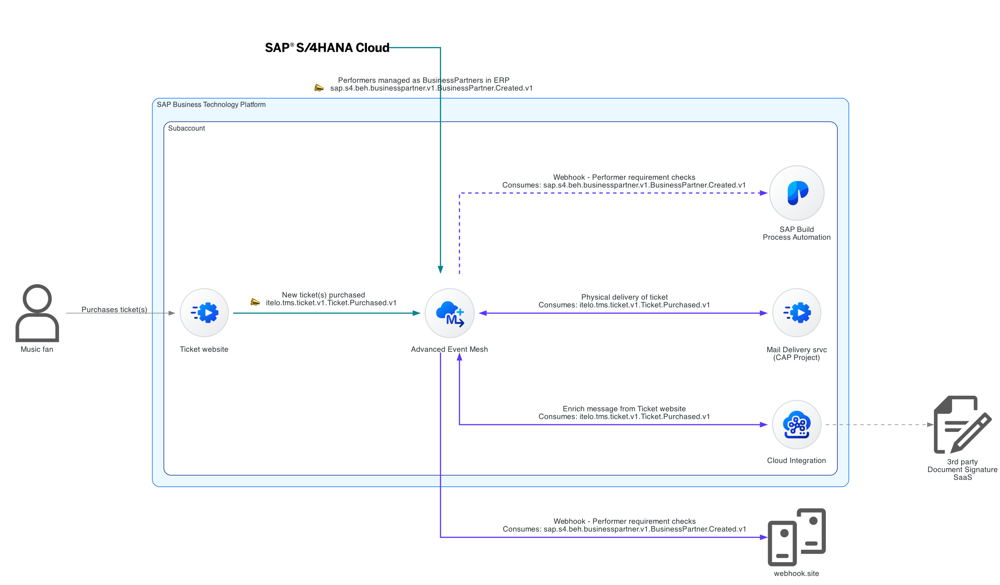

# Exercise 10 - Consuming messages from CAP project



There is a separate service which is simulating the ticket purchased events from the ticket website. It will also be publishing the purchased tickets events to `itelo/TMSPRD/ce/tms/ticket/v1/Ticket/Purchased/v1` topic. We will consume these events from a CAP project in this exercise. Below you can see a sample event message generated by the service.

```json
{
  "specversion": "1.0",
  "type": "itelo.tms.ticket.v1.Ticket.Purchased.v1",
  "source": "https://tms-prod.itelo-entertainment.com/tickets",
  "subject": "VPHAH0OC",
  "id": "d121e256-2afd-1724-c80b-b5l3645357fa",
  "time": "2024-05-06 10:10:00",
  "datacontenttype": "application/json",
  "data": {
    "ID": "VPHAH0OC",
    "Customer": {
      "Name": "John Doe",
      "Email": "john.doe@gmail.com"
    },
    "CustomerAddress": {
      "Street": "123 Main St",
      "City": "Anytown",
      "State": "CA",
      "Postcode": "12345",
      "Country": "USA"
    },
    "TicketType": {
      "ID": 1,
      "Description": "General Admission"
    },
    "DeliverTicketsByMail": true,
    "NumberOfTickets": 2
  }
}
```

## Create a queue in the EU-North-Broker


👉 Access the `EU-North-Broker` and create a new queue with the following name: `codejam/edi/[your-sap-community-id]/Tickets/Purchased`. Once created, subscribe to the `itelo/TMSPRD/ce/tms/ticket/v1/Ticket/Purchased/v1` topic.

We've created the queue that we will be connecting from the CAP project to consume the events.


## Summary

TODO: Complete summary

## Further Study

* [CAP Documentation](https://cap.cloud.sap/docs/)

---

If you finish earlier than your fellow participants, you might like to ponder these questions. There isn't always a single correct answer and there are no prizes - they're just to give you something else to think about.

1. 
2. 
3. 

## Next

Continue to 👉 [Exercise 11 - ....](../03-/README.md)
