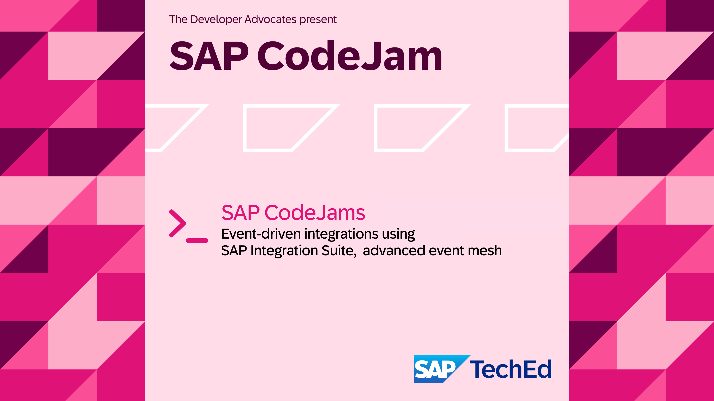
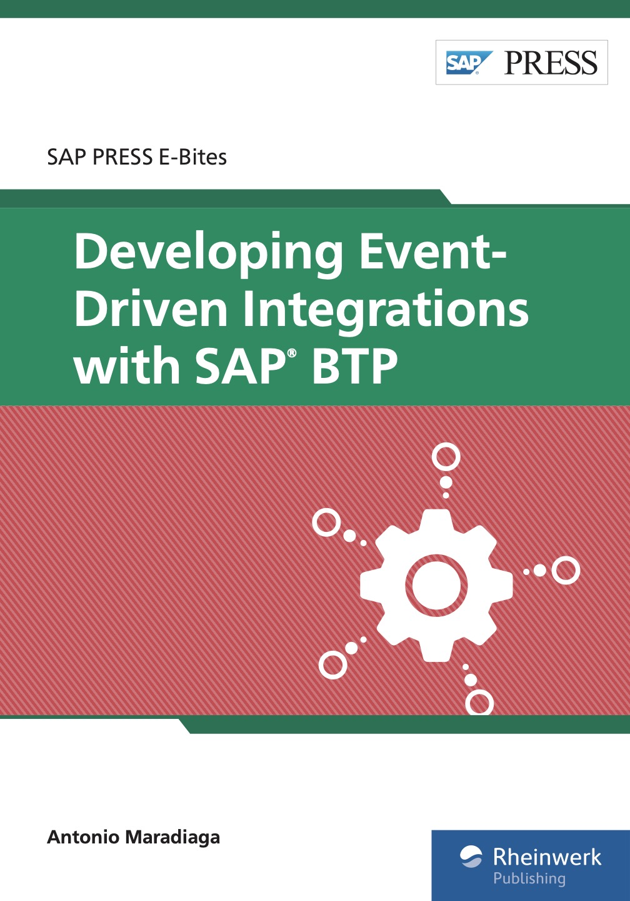

<!-- paginate: false -->

---
<!-- paginate: false -->

# Participants Handbook

 

- [Event-Driven integration scenario](#event-driven-integration-scenario)
- [Access to SAP Integration Suite, advanced event mesh](#access-to-sap-integration-suite-advanced-event-mesh)
- [Placeholders and Icons](#placeholders-and-icons)
- [Important Links](#important-links)
- [Event Broker Services](#event-broker-services)
- [Session Feedback](#thanks-for-attending)

     

--- 
<!-- paginate: true -->
# Event-driven integration scenario

<!-- _class: centersingleimage -->

--- 
<!-- paginate: true -->
# Access to SAP Integration Suite, advanced event mesh

<!-- _class: centersingleimage -->

- Tenant URL: https://eu10.console.pubsub.em.services.cloud.sap/login?tenant-id=700941ea-995f-4faa-95a4-10dcd448ad5c 
- Your username: `[your-sap-community-display-name]@sap.com` 
- Password: `AEMRocks123` 

  

--- 
<!-- paginate: true -->
# Placeholders and Icons

 

- `[your-sap-community-display-name]` - Used in the content to represent your SAP Community display name and keep objects separate from other participants. Replace it with your actual SAP Community display name, e.g. [ajmaradiaga](https://community.sap.com/t5/user/viewprofilepage/user-id/107).
- 👉 An action that you need to carry out in the exercise.
- 🔐  Indicates that a secret is required. You should find the secret in this handbook.
- ⇟ Used to indicate that the content is "hidden" and can be expanded by clicking on it.

  

---
<!-- paginate: true -->
# Important Links

 

- CodeJam content: https://github.com/SAP-samples/event-driven-integrations-codejam
  - Do you prefer accessing the content via a website?
  https://sap-samples.github.io/event-driven-integrations-codejam/
- Exercises: https://github.com/SAP-samples/event-driven-integrations-codejam/tree/main/exercises
- Clone repository URL: https://github.com/SAP-samples/event-driven-integrations-codejam.git

   

---

# Event Broker Services

 

| Name | Username | Password |
  |---|---|---|
  | EU-North-Broker | `solace-cloud-client` | `6gbl68bfqpdbl8o15e9icilspr` |
  | AMER-USEast-Broker | `solace-cloud-client` | `gpqu6veuthu19lhlr6og9ostii` |
  | APJ-IN-Broker | `solace-cloud-client` | `Madrid-Amplify-Events8` |

 

📝 The complete connection details for each event broker service can be found in the **Connect** tab
 

--- 
<!-- _class: centersingleimage -->

# Interested in learning more?

 

Developing Event-Driven Integration with SAP BTP: [https://www.sap-press.com/developing-event-driven-integrations-with-sap-btp_6021/](https://www.sap-press.com/developing-event-driven-integrations-with-sap-btp_6021/)
(Available now!)

--- 
<!-- _class: centersingleimage -->

# Thanks for attending!!!

Your feeback is important to us! Please take a moment to send us your feedback on this session by replying to the email you received with your user credentials.
