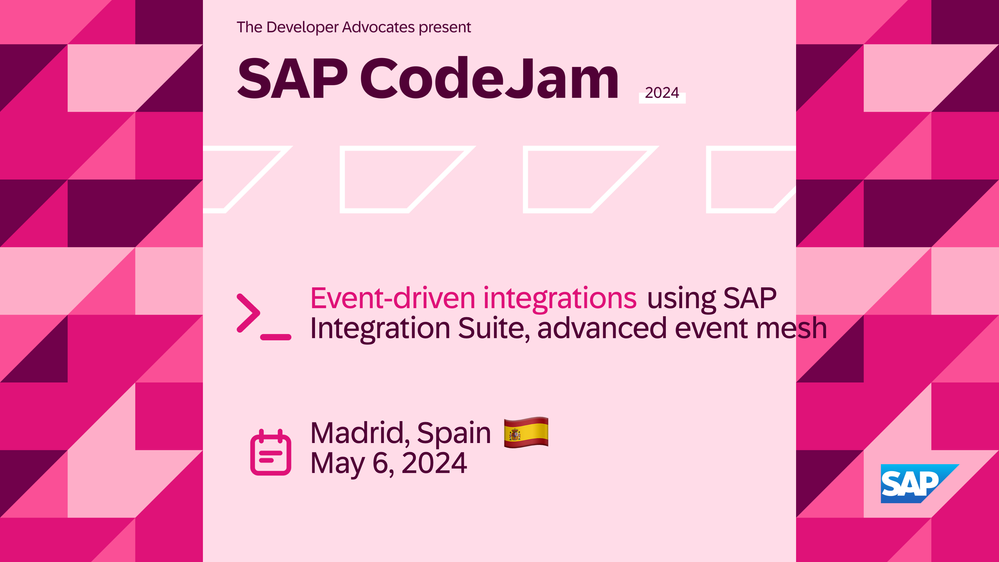
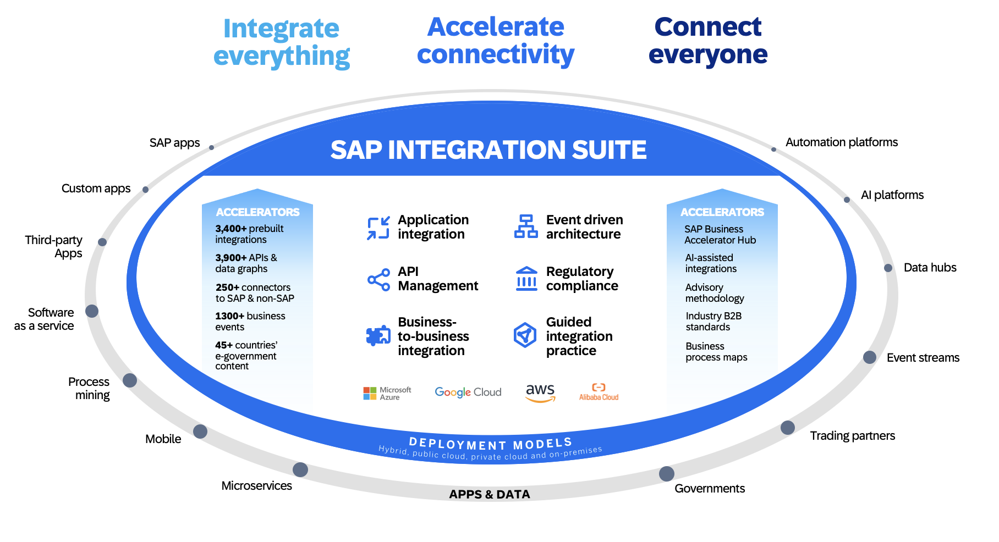
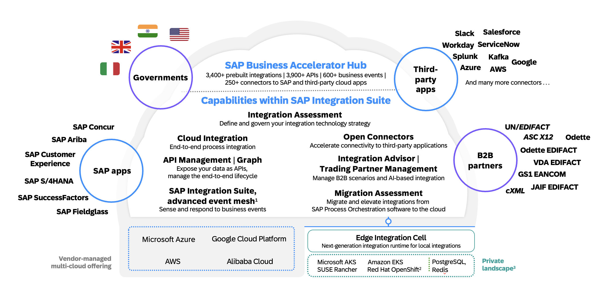
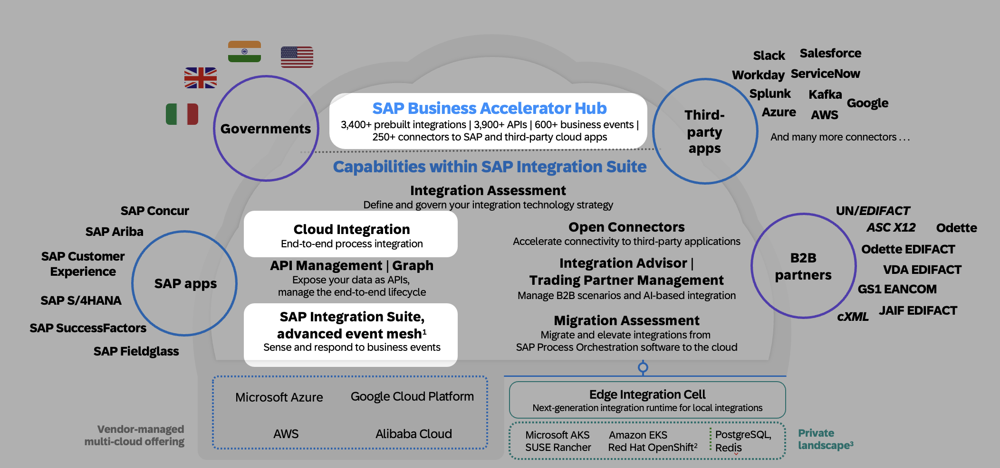

<!-- paginate: false -->

---
<!-- paginate: false -->

---
<!-- paginate: false -->

---
<!-- paginate: false -->

---
# SAP CodeJam - Agenda

 

- *10:00* - Introduction
- *10:30* - Exercise 01 - 05
- *12:00* - Break
- *12:30* - Exercise 06 - 11

 
 
 

---
<!-- paginate: true -->

# SAP Integration Suite

---
<!-- paginate: true -->

# SAP Integration Suite - Services

---
<!-- paginate: true -->

# SAP Integration Suite - part of the CodeJam

--- 

# SAP CodeJam - Event-Driven Integrations scenario

<!-- _class: centersingleimage -->

--- 

# [SAP CodeJam - Repository](https://github.com/SAP-samples/event-driven-integrations-codejam/)
 
 <!-- _class: centersingleimage -->

--- 

<!-- _footer: "*[Troubleshooting](https://github.com/SAP-samples/event-driven-integrations-codejam/blob/main/troubleshooting.md#troubleshooting): Whenever you face an issue, make sure to check this page first.*" -->

# SAP CodeJam - Exercises (Part 1)

 

* [Exercise 01 - Events in the SAP Ecosystem](./exercises/01-events-sap-ecosystem/README.md) (15')
* [Exercise 02 - Cloud Events](./exercises/02-cloudevents/README.md) (15')
* [Exercise 03 - SAP's adoption of CloudEvents](./exercises/03-cloudevents-at-sap/README.md) (15')
* [Exercise 04 - Event-Driven Architectures](./exercises/04-event-driven-architectures/README.md) (15')
* [Exercise 05 - Explore SAP Integration Suite, advanced event mesh](./exercises/05-explore-aem/README.md) (15')

  

<!-- _footer: "*[Troubleshooting](https://github.com/SAP-samples/event-driven-integrations-codejam/blob/main/troubleshooting.md#troubleshooting): Whenever you face an issue, make sure to check this page first.*" -->

---

# SAP CodeJam - Exercises (Part 2)

 

* [Exercise 06 - Publish and subscribe to events](./exercises/06-publish-and-subscribe-events/README.md) (15')
* [Exercise 07 - Exchanging messages between Event Broker Services (Dynamic Message Routing)](./exercises/07-dynamic-message-routing/README.md) (15')
* [Exercise 08 - Create a CloudEvent programmatically (CloudEvents SDK)](./exercises/08-cloudevents-sdk/README.md) (15')
* [Exercise 09 - Forward messages in Queue to REST Consumer (REST Delivery Points/webhooks)](./exercises/09-rest-delivery-points/README.md) (15')
* [Exercise 10 - Consuming messages from CAP project (AMQP protocol)](./exercises/10-consume-message-from-CAP/README.md) (15')
* [Exercise 11 - Process messages from Cloud Integration (AEM Adapter and SMF protocol)](./exercises/11-aem-cloud-integration-adapter/README.md) (15')

 

<!-- _footer: "*[Troubleshooting](https://github.com/SAP-samples/event-driven-integrations-codejam/blob/main/troubleshooting.md#troubleshooting): Whenever you face an issue, make sure to check this page first.*" -->

---

<!--
# SAP CodeJam - Exercises (Optional)

  

* [Optional Exercise 01 - Expose integration flow via API Management](./exercises/optional-01-expose-integration-flow-api-management/README.md)
* [Optional Exercise 02 - API Security Best Practices](./exercises/optional-02-security-best-practices/README.md)
* [Optional Exercise 03 - API Providers](./exercises/optional-03-api-provider/README.md)

        
---

-->

URL: https://bit.ly/edi-madrid-may-2024
Password: *🔐 Provided by instructor*

--- 
<!-- _class: centersingleimage -->

# [Exercise 01 - Events in the SAP Ecosystem](./exercises/01-events-sap-ecosystem/README.md) (10')

--- 
<!-- _class: centersingleimage -->

# [Exercise 02 - Cloud Events](./exercises/02-cloudevents/README.md) (15')

   

--- 
<!-- _class: centersingleimage -->

# [Exercise 03 - SAP's adoption of CloudEvents](./exercises/03-cloudevents-at-sap/README.md) (15')

--- 
<!-- _class: centersingleimage -->

# [Exercise 04 - Event-Driven Architectures](./exercises/04-event-driven-architectures/README.md) (15')

 
 

  

--- 
<!-- _class: centersingleimage -->

# [Exercise 05 - Explore SAP Integration Suite, advanced event mesh](./exercises/05-explore-aem/README.md) (15')

--- 
<!-- _class: centersingleimage -->

# [Exercise 06 - Publish and subscribe to events](./exercises/06-publish-and-subscribe-events/README.md) (15')

--- 
<!-- _class: centersingleimage -->

# [Exercise 07 - Exchanging messages between Event Broker Services (Dynamic Message Routing)](./exercises/07-dynamic-message-routing/README.md) (15')

--- 
<!-- _class: centersingleimage -->

# [Exercise 08 - Create a CloudEvent programmatically (CloudEvents SDK)](./exercises/08-cloudevents-sdk/README.md) (15')

 
 

 
 
 

--- 
<!-- _class: centersingleimage -->

# [Exercise 09 - Forward messages in Queue to REST Consumer (REST Delivery Points/webhooks)](./exercises/09-rest-delivery-points/README.md) (15')

--- 
<!-- _class: centersingleimage -->

# [Exercise 10 - Consuming messages from CAP project (AMQP protocol)](./exercises/10-consume-message-from-CAP/README.md) (15')

 

   

--- 
<!-- _class: centersingleimage -->

# [Exercise 11 - Process messages from Cloud Integration (AEM Adapter and SMF protocol)](./exercises/11-aem-cloud-integration-adapter/README.md) (15')

 

 

--- 
<!-- _class: centersingleimage -->

# Thanks for attending!!!

