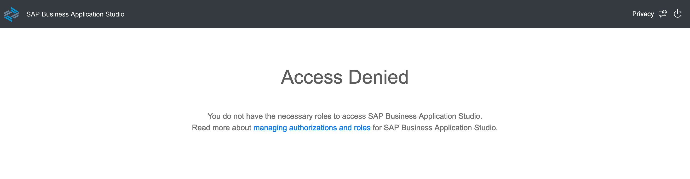

# Troubleshooting

This page intends to capture common problems that you might face while going through the exercises part of the CodeJam. 

## SAP Integration Suite, advanced event mesh

- #### The event broker services are not listed/visible in Cluster Manager
  
  By default the Cluster Manager will only show the event broker services that you have created. If you are not seeing the event broker services that you expect, you might have the `Only show my service` checkbox checked.

  <p align = "center">
    <br/>
    <i>Cluster Manager - Only show my services, unchecked</i>
  </p>

  Solution:
  - Uncheck the `Only show my service` checkbox in the Cluster Manager

### SAP Business Application Studio

- #### Access Denied when trying to access the SAP Business Application Studio
  
  <p align = "center">
    <br/>
    <i>Business Application Studio - Access Denied</i>
  </p>

  Your user account might not have the necessary permissions to access the SAP Business Application Studio. Make sure to assign the below role collections to your user account in the SAP BTP cockpit (Subaccount > Security > Users > [select the user] > Assign Role Collections):
  - `Business_Application_Studio_Administrator`
  - `Business_Application_Studio_Developer`

  <p align = "center">
    <br/>
    <i>Business Application Studio - Role collections</i>
  </p>


## CAP Project

- #### SqliteError: no such table: com_sap_codejam_edi_ConsumedMessage
  
  When running the CAP project you get an error message stating that it was not possible to insert a record into the `com_sap_codejam_edi_ConsumedMessage` table because the table does not exist.

  Ensure that you've run the `cds deploy` command to deploy the data model to the SQLite database. From within the project directory, run the following command:
  ```bash
  cds deploy
  ```

- #### SqliteError: no such table: com_sap_codejam_edi_ConsumedMessage
  
  When running the CAP project you get an error message stating that it was not possible to insert a record into the `com_sap_codejam_edi_ConsumedMessage` table because the table does not exist.

  Explanation of how to solve the problem:
  - Item 1
  - Item 2 